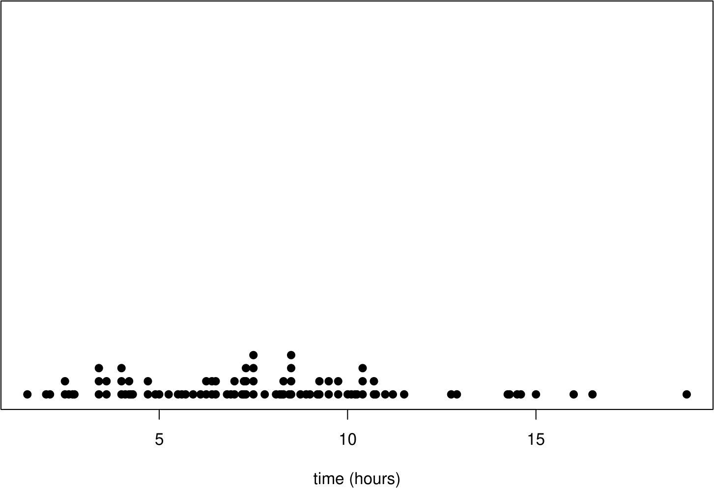
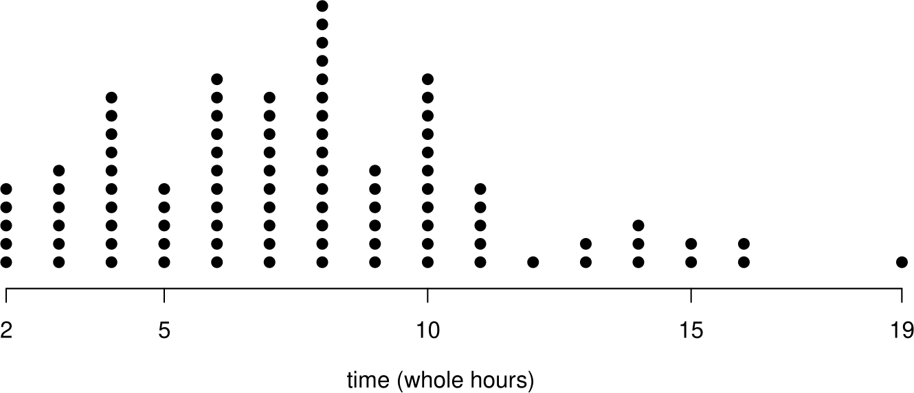

```{r setup, echo = FALSE, warning = FALSE, message = FALSE}

library(knitr)
library(dplyr)
library(huxtable)
options(
        huxtable.knit_print_df       = FALSE, 
        huxtable.add_colnames        = TRUE,  # needed when run by testthat
        huxtable.latex_use_fontspec  = TRUE,
        huxtable.bookdown            = TRUE
      )

is_latex <- guess_knitr_output_format() == "latex"
# is_latex <- TRUE
knitr::knit_hooks$set(
  barrier = function(before, options, envir) {
    if (! before && is_latex) knitr::asis_output("\\FloatBarrier")
  }
)

if (is_latex) knitr::opts_chunk$set(barrier = TRUE)
```

```{r, figsetup2, include=FALSE}
knitr::opts_chunk$set(
  fig.align = 'center',
  out.width = '80%'
)
```

```{r, echo = FALSE}
include_cropped_graphics <- function(x) {
#  knitr::include_graphics(knitr::plot_crop(x))
  knitr::include_graphics(x)
}
```

# Descriptive Statistics

The first important step in any data analysis is to **describe** the 
available data.  This is often called an **exploratory** or **initial** data analysis. It is normally not possible to just look at the dataset, especially if it is large, and just see any interesting structures. The task of a statistician is therefore to **extract** and **condense** the relevant information -- what is relevant will depend on the aim of the analysis. Some of  the standard methods to do so are addressed in the next sections. Despite all the technicalities, always remember that the numbers / figures / plots produced for data must be **interpreted with regard to the problem or question at hand**, that is, always ask yourself "what does this number / plot mean?".

Before embarking on a formal statistical analysis of the data we should look at summaries of the data such as graphs, tables and summary statistics.  This can be important to

1. reveal problems with, or errors in, the data;
2. get a `feel' for the data;
3. identify interesting features of the data, e.g. is treatment A very 
obviously better at treating a disease than treatment B?;
4. suggest how the data should be analysed;
5. present conclusions.

In some cases the data summaries make it very clear what is going on and may 
make more formal methods of statistical analysis unnecessary.

## Types of data

Before analysing data it is important to consider what **type** they are. This will affect which statistics it is sensible to calculate, which graphs it is sensible to plot and which of the simple distributions we will study in section \@ref(simple) might be used for these data.

### Qualitative or categorical data

Items are assigned to **groups** or **categories** based on some **qualitative** property.  Examples:

* Hair colour: blonde, brown, red, black etc.
* Smoking status: smoker, non-smoker;
* Severity of illness: none, mild, moderate, severe;
* Degree class: 3, 2ii, 2i, 1.

The data are **labels**: if numbers are assigned to the categories (e.g. 
0=smoker, 1=non-smoker) the numbers chosen do not mean anything in themselves.

Categorial data can be classified as either

* **nominal**: the categories are unordered, e.g. hair colour, smoking status;
* **ordinal**: the categories are ordered, e.g. severity of illness, degree class.

An important special case is **binary** data: categorical data with only 2 categories.  These data can be nominal (e.g. male, female) or ordinal (e.g. small, large).

Nominal data: describe by (relative) frequencies.  It is sensible to quote the mode, but not the mean or median.

Ordinal data: It is sensible to quote the mode or median, but not the mean.

### Quantitative or numerical data

Items are measured in some way based on some **quantitative** property.  This produces a one, or more, **numbers**. Examples:

* Time, in hours;
* Height, in cm;
* Age, in years;
* Number of damaged O-rings (see space shuttle investigation);
* Number of births on one day at a particular hospital;
* Number of units passed in first year.

Numerical data can be classified as either

* **Discrete**. Only certain values are possible (there are gaps between the possible values), e.g. number of damaged O-rings, number of births, number of units passed in first year (0, 0.5, 1, 1.5, 2, 2.5, 3, 3.5, 4);
* **Continuous**. In theory, **any** value within an interval of the real line 
is possible, e.g. time, height, age.

Often discrete data are **counts**.  Continuous data usually come from measurement. In practice continuous data are recorded discretely, e.g. to two decimal places.

#### Interval data and ratio data {-}

Quantitative data can be further classified as **interval** or **ratio**. Both interval data and ratio data have the property that an increase of 1 unit means the same whether it is from, say, 1 to 2 or from 10 to 11. However,

* a ratio scale has a natural zero, for example, temperature measured in degrees Kelvin;
* an interval scale does not have a natural zero, for example temperature 
measured in Fahrenheit.

Ratios are only meaningful on a ratio scale.  For example,

* IQ: A zero IQ does not exist.  A person with an IQ of 120 is not twice as intelligent as a person with an IQ of 60. Therefore, IQs are interval data.
* Income: A zero income does exist.  A person whose take-home income is \pounds 20,000 does earn twice as much as some whose take-home income is \pounds 10,000.Therefore, incomes are ratio data.

## Describing distributions

In describing the distribution of one variable the following it is important to 
examine the following.

1. **Location / average / central tendency of the data**. Where is the centre of the distribution?  What is a typical value?  
2. **Spread / variability / dispersion / scale**. How **variable** are the data?  How far are they spread out?
3. **Shape**.  What shape is the distribution of the data?  In particular, is it **symmetric** or **skewed**, and if skewed, which way?  A long tail to the right is called **positive skew** (or right skew or skewed to the right). A long tail to the left is known as a **negative skew** (or left skew or skewed to the left). Positive skew is much more common than negative skew.  Figure \@ref(fig:shapes) gives some examples of shapes of symmetric, positive skew and negative skew distributions. In addition to being symmetric the plot in the top left of Figure \@ref(fig:shapes) of figure is bell-shaped. This shape is the shape of a **normal distribution** (see Section \@ref(normal)).  The normal distribution is an important distribution in Statistics.  We may wish to decide whether the data look like they have come from a normal distribution.
4. **Outliers**.  Are there any outliers, that is, observations that appear to be out of line with the pattern of the rest of the data? This issue can also be hard to judge. For example, with a small number of observations, it is difficult to distinguish between data from a heavily skewed distribution and data from a symmetric distribution with outliers. What constitutes an outlier depends on the context so there is no rigid rule for defining/detecting outliers. The intended statistical analysis also matters. We will consider how to deal with outliers (in the context of linear regression) in Section \@ref(outliers).
5. **Is there anything else to report?**  Note any **unusual features** 
about the data.  Are there particular numbers which appear more often than we could expect? Do the data separate into groups?

```{r echo=FALSE, shapes, fig.show='hold', fig.cap='Examples of shapes of symmetric, positively skewed and negatively skewed distributions.'}
include_cropped_graphics("images/shapes.png")
```

We will look at 3 ways basic tools which are used to describe and summarise data: summary statistics, tables and graphs.  We can use a combination of these. For example summary statistics may be presented in a table or a graph. Carefully produced graphs are often the best way to describe, explore and summarise a set of data. Summary statistics reduce the data to a small set of numbers.  Tables can retain more information but do not work well for datasets which are large or have many variables. In contrast graphs can show most, if not all, the information in the data and reveal complex relationships.

### Example: Oxford births data {-}

Table \@ref(tab:taboxbirths) shows the times (in hours) spent by 95 women giving birth in the delivery suite of the John Radcliffe Hospital in Oxford during 1 week.  These are ratio data.  At first we ignore the fact that the data are recorded on different days.

```{r taboxbirths, tidy=FALSE, echo=FALSE, message = FALSE}
ox_mat <- matrix(NA, ncol = 7, nrow = 16)
for (i in 1:7) {
  day_i_times <- stat0002::ox_births$time[which(stat0002::ox_births$day == i)]
  ox_mat[1:length(day_i_times), i] <- sort(day_i_times)
  colnames(ox_mat) <- paste("day", 1:7, sep = "")
}  
opts <- options(knitr.kable.NA = "")
knitr::kable(
  ox_mat, 
  caption = 'Time (in hours) spent by each of 95 women giving birth at the John 
Radcliffe hospital in Oxford, UK, during a particular week.',
  booktabs = TRUE
)
```

## Summary Statistics

One way to summarise a dataset is to calculate numerical summaries called **summary statistics**. Summary statistics can be used as indicators of the location, spread and shape of the data (although looking at a plot can be more helpful).

### Five number summary

A useful first impression of the distribution of quantitative or ordinal data is given by the a five number summary.  As we will see later, the five number summary involves quantities called **sample quantiles**. These are estimates of theoretical quantities that we will study in Section \@ref(rvs). There is more than one way to calculate sample quantiles.  For example, the R statistical package has 9 options in its `quantile()` function. The particular method given below is just one of these options.

If a dataset of observations, $x_1,x_2,\ldots,x_n$, is arranged in order of size as $$ x_{(1)} \leq x_{(2)} \leq \cdots \leq x_{(n)}$$ then the **sample median** is the `middle' value (halfway between $x_{(1)}$ and $x_{(n)}$), that is,
$$ m=x_{(\frac{1}{2}(n+1))}\,.$$
The median is a measure of location.

Informally, we can think of the **sample lower quartile** as the sample median of the lower half of the data, or, equivalently, as the value that divides the lower 25\% of the data from the rest of the data.  One way to estimate this is 
$$ q_L=x_{(\frac{1}{4}(n+1))} \,.$$
Similarly, we can think of the **sample upper quartile** as the sample median of the upper half of the data, which we could estimate using
$$ q_U=x_{(\frac{3}{4}(n+1))}\,.$$
If $m, q_L$ or $q_U$ do not correspond directly with one of the observations 
then we can use linear interpolation.  Suppose that $n=44$.  Then we could calculate the sample median using 
$$x_{(22.5)}=x_{(22)}+\frac12\left(x_{(23)}-
x_{(22)}\right)=\frac{x_{(22)}+x_{(23)}}{2}, $$
the sample lower quartile using
$$ x_{(11.25)}=x_{(11)}+\frac14\left(x_{(12)}-
x_{(11)}\right)=\frac34\,x_{(11)}+\frac14\,x_{(12)}, $$
and the sample upper quartile using 
$$x_{(33.75)}=x_{(33)}+\frac34\left(x_{(34)}-
x_{(33)}\right)=\frac14\,x_{(33)}+\frac34\,x_{(34)}.$$
This is not the only possibility: you may find that different methods are used in some textbooks and by some computer packages. If the data are ordinal then interpolating may not make sense.

The quartiles $q_L, m, q_U$ (so called because they divide the data into 4 equal parts) are sometimes denoted $q_1, q_2$ and $q_3$.

The **five number summary** of the data set is the set of values
$$x_{(1)},q_L,m,q_U,x_{(n)}\,,$$
that is, the sample minimum, lower quartile, median, upper quartile and maximum.

The **range** is defined as $x_{(n)}-x_{(1)}$ and the **inter-quartile 
range** (IQR) as $q_U-q_L$.  The range and IQR are measures of spread.

More generally, we could could calculate sample **quantiles**, or **percentiles**. The 30\% quantile, for example, is the value at or below which 30\% of the data lie. The 100$p$\% sample quantile is $x_{(p(n+1))}$.  When $p(n+1)$ is not an integer, $x_{(p(n+1))}$ can be calculated using linear interpolation. Note: the number of quantiles which we can estimate reliably depends on the **sample size** $n$. For example, if $n=3$, it doesn't make sense to try to estimate the 10\% quantile. In this case $q_L=x_{(1)}, m=x_{(2)}$ and $q_U=x_{(3)}$.

Sometimes the sample size $n$ is added to the five number summary.  The 
sample size can be of interest in its own right, for example when it records the 
number of times an event of interest occurs in a fixed period of time,
for example, the number of births in the delivery suite of the John Radcliffe 
hospital in Oxford during one week.

### Mean and standard deviation

The most well known descriptive measures of **numerical** data are the (arithmetic) mean and the standard deviation.

The **sample mean**, a measure of location, is defined as the arithmetic average
$$ \bar{x}\,=\,\frac{1}{n}(x_1+x_2+\cdots+x_n)=\frac{1}{n}\sum_{i=1}^n x_i\,.$$
The **sample variance**, a measure of spread, is 
$$ s^2 \,\,=\,\, \frac{1}{n-1}\sum_{i=1}^n (x_i-\bar{x})^2 \,\,=\,\, \frac{1}{n-1}\left\{\sum_{i=1}^n x_i^2 - n(\bar{x})^2\right\}\,.$$
The **sample standard deviation**, also a measure of spread, but has the same units as the data, is
$$ s=\sqrt{s^2} \,.$$
For example, if the units of the data are metres then the units of the variance are metres$^2$ and the units of the standard deviation are metres.

The formula (with a different denominator)
$$ \frac{1}{n}\sum_{i=1}^n (x_i-\bar{x})^2 \,,$$
which is used by some calculators is equal to  $s^2 (1-1/n)$,  **not** $s^2$. For large $n$ the values of $s^2$ and $s^2(1-1/n)$ will be close.

For data that are very skewed, or contain outliers, the sample median may be a more appropriate measure of location than the sample mean.  This is because the value of the sample mean is strongly influenced by large or small values.  For example, if the data are positively skewed the value of the mean may be much larger than where we would judge by eye the centre of the data to be.  However, for data which are fairly symmetric there are reasons to prefer the sample mean to the sample median.  For example, 

* the sample mean is easier to calculate;
* if samples are taken repeatedly the sample mean varies less than the sample median.

We will examine this in more detail in Section \@ref(good).

Similarly, for a measure of spread, the sample standard deviation may be preferred for approximately symmetric data with no outliers, otherwise the IQR is preferable.

### Mode

For categorical data or discrete data the mode is the value (or values) which occurs most often.  The concept of a mode is relevant to continuous data, but it is less obvious how we might estimate this using data.  We return to this in Section \@ref(locations).  The mode is a measure of location.  

#### Examples {-}

What are the sample mean, median and mode of the following data?

> blonde hair, red hair, red hair, black hair 

What are the sample mean, median and mode of the degree classes? 

> 3, 2ii, 2i, 1, 1

What are the sample mean, median and mode of the following numbers?

> 10, 350 

Which measures of location are sensible for different types of data?  Consider each case in Table \@ref(tab:whichmeasures).

|  | mean | median | mode |
|:------|:-----:|:-----:|:-----:|
| nominal   |  |  |  |
| ordinal   |  |  |  |
| numerical |  |  |  |

Table: (\#tab:whichmeasures) Types of data and measures of location.

### Symmetry {#symmetry}

Many standard statistical methods work best when the data are distributed symmetrically. Looking at a graph is the best way to examine whether this is true.  However, the relative values of the sample mean and sample median can give us an idea whether the data are approximately symmetric, as summarised in Table \@ref(tab:thumb), but this rule-of-thumb can be misleading.

| mean $<$ median | mean = median | mean $>$ median |
|:------:|:-----:|:-----:|:-----:|
| negative skew | symmetric | positive skew |

Table: (\#tab:thumb) Relative values of the sample mean and median and what this **might** suggest in some cases.

#### Example. Oxford births data {-}

Table \@ref(tab:oxfivenum) gives the five-number summary of the Oxford birth times data.

| $x_{(1)}$ | $q_L$ | $m$ | $q_U$ | $x_{(n)}$ |
|:------:|:-----:|:-----:|:-----:|:-----:|
| 1.50 | 4.90 | 7.50 | 9.75 | 19.00 |

Table: (\#tab:oxfivenum) Sample five-number summary of the Oxford birth times data.

Half of the women took between approximately 5 and 10 hours to give birth.The quickest delivery was 90 minutes and the longest 19 hours. The mean $\bar{x}$ is 7.72 hours and the standard deviation is 3.57 hours. The fact that sample mean $>$ sample median suggest that the data are slightly positively skewed, but this is something that we should confirm by looking at a suitable graph (see Section \@ref(graphs)).

#### Measures of skewness {-}

Usually the best way to examine the shape of a distribution is to look at a graph see section \@ref(graphs). In addition we could calculate summary measures of skewness, such as: the **standardized sample skewness**
$$\mbox{skewness} = \frac{\displaystyle\frac1n \sum_{i=1}^n (x_i-
\overline{x})^3}{s^3}, $$
where $s$ is the sample standard deviation, and the **sample quartile 
skewness**
$$\mbox{quartile skewness} = \frac{(q_U-m)-(m-q_L)}{q_U-q_L}, $$
where $q_L, m$ and $q_U$ are the sample quartiles.

These measures are each 0 for perfectly symmetric data, negative for negative skew data and positive for positive skew data.  The standardized sample skewness can take any value on the real line. The quartile skewness must lie in $[-1, 1]$. The quartile skewness has the advantage that it is less sensitive to outliers than the standardized sample skewness.

For the Oxford births data the standardized sample skewness is 0.63 and the sample quartile skewness is -0.072. In this example, the standardized sample skewness suggests that the data are positively skewed, whereas the quartile skewness suggests that the data are (slightly) negatively skewed.  

Table \@ref(tab:sumstats) summarises the summary statistics may be used as measures of location, spread and shape.

| location | spread | shape |
|:------:|:-----:|:-----:|
| median | inter-quartile range | quartile skewness |
| mean   | standard deviation or variance | skewness |
| mode   |                                |          |

Table: (\#tab:sumstats) Summary of summary statistics

### Correlation

Measures of correlation aim to summarise the strength of the relationship between two variables. Suppose that we have two samples $x_1,\ldots,x_n$ and $y_1,\ldots,y_n$ of **paired** data. For example, $x_1$ and $y_1$ could be the height and weight of person 1, $x_2$ and $y_2$ the height and weight of person 2, etc.

The sample correlation coefficient
\begin{equation}
r = \frac{\displaystyle\sum_{i=1}^n (x_i-\bar{x})(y_i-
\bar{y})}{\sqrt{\displaystyle\sum_{i=1}^n (x_i-\bar{x})^2 \displaystyle\sum_{i=1}^n(y_i-
\bar{y})^2}} \,\,\, \in [-1, 1]. 
(\#eq:corr)
\end{equation}
measures the strength of **linear** association between the two variables.

We will look at correlation in detail later in the course (in Section \@ref(correlationchapter)). We must be careful to use the sample correlation coefficient only when it is appropriate to do so. We will see that it is important to plot the data.

The product-moment correlation coefficient $r$ is not the only possible measure of correlation.  An alternative is **Spearman's rank correlation coefficient** $r_S$.  First we rank the $x_1,\ldots,x_n$ values, giving a rank of 1 to the largest $x$ value, a rank of 2 to the second largest, down to a rank of $n$ for the smallest value. This gives ranks $r^x_1, \ldots, r^x_n$. Then we do the same with $y_1,\ldots,y_n$ to produce ranks $r^y_1, \ldots, r^y_n$. [If there are ties then we average the ranks of tied observations, e.g. if the 3rd and 4th largest values are equal then they each get a rank a 3.5.] Then we calculate the product-moment correlation of the paired ranks$(r^x_i, r^y_i), i=1,\ldots,n$ using equation \@ref(eq:corr). If there are no ties then $r_S$ simplifies to
$$r_S = 1- \frac{6\displaystyle\sum_{i=1}^n d_i^2}{n(n^2-1)}, $$
where $d_i=r^x_i-r^y_i$ is the difference in the ranks of $x_i$ and $y_i$. The general idea is to extract from the raw data only the ordering of the data points.

The choice between using $r$ or $r_S$ as a measure of correlation is similar to the choice between using the sample mean or the sample median as a measure of location. In particular, $r_S$ is less sensitive to outliers than $r$.  
We have noted that $r$ measures the strength of **linear** association between two variables.  In contrast $r_S$ is a measure of how close the relationship between the variables is to being **monotone**, i.e. either increasing or decreasing but not necessarily linear. If $r_S=1$ then the data have a perfect monotone increasing relationship. If $r_S=-1$ then the data have a perfect monotone decreasing relationship.

#### A simple example {-}  

Consider the small dataset in Table \@ref(tab:smalldata).

| $x_i$ | rank $x_i$ | $y_i$ | rank $y_i$ | $d_i$ |
|------:|-----:|-----:|-----:|-----:|
| $-2$ | $6$ | $-1.5$ | $6$ | $0$ |
| $-1$ | $5$ | $-1.1$ | $5$ | $0$ | 
| $0$ |  $4$ | $0.2$ | $4$ | $0$ |
| $1$ |  $3$ | $1.1$ | $3$ | $0$ |
| $2$ |  $2$ | $1.6$ | $1$ | $1$ |
| $10$ | $1$ | $1.5$ | $2$ | $-1$ |

Table: (\#tab:smalldata) A small example dataset.

**Exercise**. Show that for these data $r=0.70$ and $r_S=0.94$. Can you explain why $r_S>r$?  Looking at a scatter plot of $y$ against $x$ will help you see why.

## Tables 

We saw in the Space shuttle investigation (Section \@ref(shuttle)) that data can be presented in a table. We also saw that a graph can be a better way to see relationships and patterns in the data. In this section we look at a table which summarises the distribution of a set of data on one variable.  We also look at a graph based on this table.

### Frequency distribution

A **frequency distribution** is a tabular summary of a set of data that shows the number of items in each of several non-overlapping classes.  To construct a frequency distribution for a sample we need to choose:

* the number of classes;
* the width of classes. 

It is common to choose all classes to have the same width, but there may be situations where it makes sense to use classes with different widths.  For 
discrete data each data value usually constitutes a class.  

The first and second columns of Table \@ref(tab:oxfreq) show the frequency distribution of the Oxford birth times.  The first column defines the classes, the second column gives the number of observations (the **frequency**) which fall into each  class. The frequencies sum to 95, the total number of observations. The frequency distribution provides a quick way to summarise the birth times. From the table we can see that the class 6--8 hours has the largest frequency. Therefore, 6--8 hours is called the **modal class**. However, note that the frequency distribution depends on the choice of the classes.

| time (hours) | frequency | relative frequency  | cumulative frequency | cumulative relative frequency |
|:------:|:-----:|:-----:|:-----:|:-----:|
|0--2|2|0.02|2|0.02| 
|2--4|14|0.15|16|0.17| 
|4--6|14|0.15|30|0.32| 
|6--8|22|0.23|52|0.55| 
|8--10|21|0.22|73|0.77| 
|10--12|12|0.13|85|0.89| 
|12--14|2|0.02|87|0.92| 
|14--16|6|0.06|93|0.98| 
|16--18|1|0.01|94|0.99| 
|18--20|1|0.01|95|1| 
| total | 95 | 1 | || 

Table: (\#tab:oxfreq) Frequency table of all the Oxford birth times.  Note that $x$--$y$ means $x$ $<$ time $\leq y$.

#### Relative frequency distribution {-} 

Column 3 of Table \@ref(tab:oxfreq) contains the **proportion** or **relative frequency** of observations in each class.  Column 3 is calculated by dividing column 2 (the frequencies) by the total frequency (95 in this example).  This produces the **relative frequency distribution** of the data.  Column 3 shows that, for example, 15\% of the women took between 2 and 4 hours to give birth. A graphical display of the relative frequency distribution of a set of data is provided by a **histogram** (see section \@ref(histogram)).

#### Cumulative distribution {-}

Column 4 of Table \@ref(tab:oxfreq) contains the total number of observations with values less than or equal to the upper limit of each class.  This is the **cumulative frequency**. We can see that 73 of the women took no longer than 10 hours to give birth. Column 5 contains the proportion of observations with values less than the upper limit of each class.  This is the **cumulative relative frequency**. It is calculated by dividing column 4 by 95. We can see that approximately 77\% of the women took no longer than 10 hours to give birth.

It can be helpful to display the cumulative relative frequencies in a graph as in Figure \@ref(fig:oxcumfreq).

```{r echo=FALSE, oxcumfreq, fig.show='hold', fig.cap='A cumulative relative frequency distribution of the Oxford birth times.'}
include_cropped_graphics("images/ox_cum_freq.png")
```

The shape of this plot depends on the choice of the classes.  We could increase the detail in the plot by increasing the number of classes, that is, by decreasing the class width. In an extreme case we could choose the classes so that there is only one observation in each class. Table \@ref(tab:oxfreqecdf) shows how this could be done.

| time (hours) | frequency | relative frequency  | cumulative frequency | cumulative relative frequency |
|:------:|:-----:|:-----:|:-----:|:-----:|
|0--$x_{(1)}$|1|1/95|1|1/95| 
|$x_{(1)}$--$x_{(2)}$|1|1/95|2|2/95| 
|$x_{(2)}$--$x_{(3)}$|1|1/95|3|3/95| 
| $\vdots$ | $\vdots$ | $\vdots$ | $\vdots$ | $\vdots$ |
|$x_{(93)}$--$x_{(94)}$|1|1/95|94|94/95|
|$x_{(94)}$--$x_{(95)}$|1|1/95|95|1| 
| total | 95 | 1 | || 

Table: (\#tab:oxfreqecdf) Frequency table of all the Oxford birth times, with one observation in each class..

Figure \@ref(fig:oxcumfreq2) shows the resulting graph.  Notice that the shape is similar to Figure \@ref(fig:oxcumfreq) but it is less smooth. The function (from time on the horizontal axis to cumulative relative frequency on the vertical axis) is often called the **empirical cumulative distribution function** or **empirical c.d.f**.  The meaning will become clearer when we look at c.d.f.s in section \@ref(discrete).

```{r echo=FALSE, oxcumfreq2, fig.show='hold', fig.cap='A cumulative relative frequency distribution of the Oxford birth times, with classes defined so that there is one data value in each class.'}
include_cropped_graphics("images/ox_cum_freq2.png")
```

Sometimes data are given to us in the form of Table \@ref(tab:oxfreq) and the individual data values are not available.  For example, some birth data published by the Office of National Statistics data give mother's age in 5 year age bands.  Data provided in this form are called **grouped data**. We will analyse data from tables in Section \@ref(contingency).

## Graphs (1 variable) {#graphs}

These days it is very easy to plot a graph using a computer.  However, **you** need to decide which type of graph is appropriate and the default graph produced by the computer may not be very good.  Some general rules:

* **Always plot the data**. Often this will show clearly the important features of the data. Formal statistical methods may be unnecessary or simply confirm the visual impression given by the plot. Also, plotting the data can reveal potential problems with the data, for example, outlying observations which do not fit in the with the general pattern of the data, or data which are clearly wrong.
* For datasets with more than one variable always plot the variables against 
each other. There may be observations which are not unusual when variables are considered separately but are clearly unusual when 2 variables are plotted.  See Section \@ref(graphs2). 
* A good graph draws attention to important aspects of the data.  Anything which distracts the viewer, for example, excessive shading, symbols, 3-dimensional effects, should be removed.  
* Axis labels (remember the units!), the legend and caption should enable the viewer of the graph to understand the content of the graph.

### Histograms {#histogram}

A **histogram** is a graphical display based on the relative frequency distribution of a set of data on a **continuous** variable.  The variable of interest is plotted on the $x$-axis, which is divided into **bins** based on  the classes of the frequency distribution.  A rectangle is plotted for each bin.  The height of a rectangle is calculated as 
\begin{equation}
\mbox{height} = \frac{\mbox{relative frequency}}{\mbox{bin width}} = \frac{\mbox{frequency}}{n \times \mbox{bin width}}.
(\#eq:hist)
\end{equation}
Therefore, for a given box in the histogram:

* the **area** represents the relative frequency of the observations in 
the interval;
* the **height** represents the relative frequency of the observations in 
the interval **per unit of measurement**, commonly known as the **density**.

The total area under a histogram is equal to 1.  In fact a histogram is an estimate of a probability density function (see Section \@ref(continuous)). The vertical axis is commonly labelled **density**.

It is common for people to plot frequencies (rather than relative frequencies per unit), giving what I will call a **frequency plot**, that is,  **not** a true histogram.

If the bin widths are equal the shape of frequency plot is the same as the corresponding histogram.  However, when drawing a frequency plot using unequal bin widths it is important to take into account the differing widths of the bins.  For example, in the plot on the bottom left of Figure \@ref(fig:oxhistbasic), the frequency in the box for 12-20 hours is 4 times too high because the longer width of this interval has not been taken into account. 
One solution is to divide the frequencies by the bin width to produce frequencies **per unit**, but then we may as well produce a true histogram, using equation \@ref(eq:hist).

```{r echo=FALSE, oxhistbasic, fig.show='hold', fig.cap='Frequency plots (left) and histograms (right) of all the Oxford birth times.'}
include_cropped_graphics("images/ox_hist_basic.png")
```

A histogram can be useful to look at the shape of a distribution.  However, 
especially for a small dataset, the shape of the histogram can depend greatly on the classes chosen to define the bins. Figure \@ref(fig:oxhistbasic) contains histograms and frequency histograms of the all the times in Table \@ref(tab:taboxbirths).  From the histograms we can easily see that the birth times data are slightly positively skewed.

### Stem-and-leaf plots {#stem}

A **stem-and-leaf plot** (or stem plot) is like an enhanced histogram. The **stem**, on the left, contain the times in whole hours.  The **leaves**,
on the right, contain the first digit after the decimal point. An advantage of a stem-and-leaf plot is that it gives the entire dataset (perhaps rounded) in sorted order. It is easy to calculate the five number summary of the data from a stem-and-leaf plot.  Figure \@ref(fig:oxstem) shows a stem-and-leaf plot of the Oxford births data.

```{r echo=FALSE, oxstem, fig.show='hold', fig.cap='Stem-and-leaf plot of all the Oxford birth times. The decimal point is at the vertical line |. The data are rounded to the nearest 0.1 before plotting.'}
include_cropped_graphics("images/ox_stem.png")
```

### Dotplots

Dotplots are simple plots in which each observation is represented by a dot. If there are repeated observations, that is, observations with the same value (perhaps after rounding), then their dots are stacked on top of each other. Figure \@ref(fig:oxdotbasic) shows two dotplots. In the right hand plot the data were rounded to the nearest hour, producing a plot that looks a bit like a histogram with a bin width of 1 hour, with rectangles replaced by vertical lines of dots.

```{r echo=FALSE, oxdotbasic, fig.show='hold', fig.cap='Dotplots of the Oxford birth times. Top: raw data (and lots of wasted white space).  Bottom: data rounded to the nearest hour.'}


```

### Boxplots

A **boxplot** (or box-and-whisker plot) is a graphical display containing the five-number summary. It also provides ways to assess the overall shape of the data.  Figure \@ref(fig:oxdotbasic)  explains how a standard boxplot is constructed.

```{r echo=FALSE, oxboxbasic, fig.show='hold', fig.cap='Boxplot of all the Oxford birth times. The upper end (#) of the upper whisker is drawn at the largest observation within a distance $1.5 (q_U-q_L)$ of $q_U$.The lower end ($) of the lower whisker is drawn at the smallest observation within a distance $1.5 (q_U-q_L)$ of $q_L$.'}
include_cropped_graphics("images/ox_box_basic.png")
```

The `box' shows where 50\% of the data lie, that is, between the lower and uper 
quartiles. The `whiskers' extend to the most extreme observations that are within 1.5 IQR of the ends of the box. Sometimes a different criterion is used to determine the ends of the whiskers.  Any more extreme values are individually identified (with a dot here).

It can less easy easy to come to a conclusion concerning the nature of skewness using a boxplot than using a histogram. In this example the lengths of the whiskers and the presence of the value at 19 hours suggest slight positive skewness. However, the relative positions of the samples quartiles suggest (very slight) negative skewness, which is the cause of the slightly negative value of sample quartiles skewness towards the end of Section \@ref(symmetry).

Some alternatives are given in Figure \@ref(fig:oxboxadv).  Which do you prefer?

```{r echo=FALSE, oxboxadv, fig.show='hold', fig.cap='Alternative plots of the Oxford birth times based on the five-figure summary.'}
include_cropped_graphics("images/ox_box_adv.png")
```

### Barplots

A **barplot** (or bar chart) has a similar appearance to a histogram but is used for numerical discrete data or categorical data.  Therefore there are gaps between the bars in a barplot.

#### Example: numerical discrete data {-}

Table \@ref(tab:shuttlenew) shows the frequencies of the number of damaged O-rings in the space shuttle example.  Figure \@ref(fig:shuttlebarplots) shows barplots (or equivalent) of these data. Which do you prefer?

```{r shuttlenew, tidy=FALSE, echo=FALSE, warning = FALSE}
stab <- t(as.data.frame(table(stat0002::shuttle$damaged)))
row.names(stab) <- c("number of damaged O-rings", "frequency")
knitr::kable(
  stab, 
  caption = 'Frequencies of numbers of damaged O-rings for the space shuttle data.',
  booktabs = TRUE
)
```

```{r echo=FALSE, shuttlebarplots, fig.show='hold', fig.cap='Barplots of numbers of damaged O-rings on space shuttle flights.'}
include_cropped_graphics("images/shuttle_barplots.png")
```

#### Example: categorical data {-}

Table \@ref(tab:ABOnew) shows the percentages of people in the UK with the 8 main blood groups O$+$, A$+$, B$+$, AB$+$, O$-$, A$-$, B$-$ and AB$-$.  See section \@ref(bloodindep) for more details about blood groups. These data are nominal.

```{r, echo=FALSE}
temp <- stat0002::blood_types
col1 <- c(as.character(temp[1:4, 1]), "total")
col2 <- c(temp[1:4, 3], sum(temp[1:4, 3]))
col3 <- c(temp[5:8, 3], sum(temp[5:8, 3]))
blood_ct <- data.frame("blood type" = col1, "Rh+" = col2, "Rh-" = col3,
                       "total" = col2 + col3)
colnames(blood_ct)[1:3] <- c("blood type", "Rh+", "Rh-") 
```

```{r, echo=FALSE}
blood_ct_hux <- blood_ct %>% 
  as_hux() %>%
  set_label("tab:ABOnew") %>%
  set_top_border(everywhere, everywhere, brdr(0.1, "solid", "white")) %>%
  set_top_border(c(2, 6), everywhere, brdr(2, "solid", "black")) %>%
  set_right_border(everywhere, c(1, 3), brdr(2, "solid", "black")) %>%
  set_background_color(everywhere, everywhere, "white") %>%
  set_width(0.8) %>% 
  set_align(everywhere, everywhere, "center") %>% 
  set_caption("Percentages of people in the UK with the 8 main blood groups")
blood_ct_hux    
```

Figure \@ref(fig:ABObar) displays these percentages in the form of a barplot. \@ref(fig:ABOpie) does this using a pie chart. Note that in the barplot we have sorted the categories, separately within the $+$ and $-$ blood groups, in decreasing order of frequency. Do you prefer the table, the barplot or the pie chart? (Please do **not** choose the pie chart!)

```{r echo=FALSE, ABObar, fig.show='hold', fig.cap='Barplot of the UK ABO blood group percentages.'}
include_cropped_graphics("images/ABO_barplots.png")
```

```{r echo=FALSE, ABOpie, out.width='75%', fig.show='hold', fig.cap='Pie chart (right) of the UK ABO blood group percentages.'}
include_cropped_graphics("images/ABO_pie.png")
```

### Times series plots

The top plot of Figure \@ref(fig:ftsenew) shows a **time series plot** (or time plot) of the weekly closing prices of the FTSE 100 share index from 2nd April 1984 to 13th August 2007.  The bottom plot in this figure shows a different version of the same plot.

```{r echo=FALSE, ftsenew, fig.show='hold', fig.cap='Time series plots of the FTSE 100 weekly closing values, 1984--2007.  Top: default plot.  Bottom: modified version, with two vertical axes and the index measured in 1000s.'}
include_cropped_graphics("images/ftse_weekly.png")
include_cropped_graphics("images/ftse_weekly_tufte.png")
```

When observations are a time series, that is they are in time order, it is important to plot them against time to look for patterns.  The sort of features that often turn up are upward or downward trends,  or cyclical behaviour (alternative increases and decreases, often the result of seasonal behaviour), 
but you may see other aspects worth noting.  Note that 

* time should be plotted on the horizontal axis;
* the plot should be wider than it is high;
* joining the dots can help to make interesting patterns easier to see.

Figure \@ref(fig:fluts) shows a time series plot of another set of data.  Can you guess what these data might be?

```{r echo=FALSE, fluts, fig.show='hold', fig.cap='A time series plot of ?.'}
include_cropped_graphics("images/flu_tufte_no_label.png")
```

## 2000 US Presidential Election {#election}

Smith, R. L. (2002) [A Statistical Assessment of Buchanan's Vote in Palm Beach County](https://doi.org/10.1214/ss/1049993203). *Statistcal Science*, **17**(4), 441--457.

In the 2000 U.S. Presidential election George W. Bush, the Republican candidate, narrowly beat Al Gore, the Democrat candidate.  The result in the state of Florida was particularly close: Al Gore lost by only 537 votes out of 6 million votes cast.  If Al Gore had won in Florida he would have become the U.S. President.  After the election many allegations of voting irregularities were made and it was a month before Al Gore conceded defeat.

One of the results which caused most surprise was in Palm Beach County, Florida.  Pat Buchanan, the Reform Party candidate, got an unexpectedly large 3,407 votes.  Based on results in Florida as a whole only 1,300 votes would be expected.  Also, given that Palm Beach is largely a Democratic County, a right-wing candidate such as Buchanan would expect even fewer votes.

In the days following the election it was suggested that the type of ballot paper, a so-called Butterfly Ballot \@ref(fig:butterfly) used in Palm Beach had confused voters and lead to votes being cast for Buchanan by mistake.  People found the Buchanan vote in Palm Beach surprising and there is a plausible explanation for how it occurred.

```{r echo=FALSE, butterfly, fig.show='hold', fig.cap='The Butterfly Ballot used in Palm Beach county.'}
include_cropped_graphics("images/butterflyballot.png")
```

@election uses election results, and other data (on race, age, education and income), from Florida to answer the following questions:

1. Is Buchanan's vote of 3,407 very clearly out of line with the pattern of results form the rest of Florida? In Statistics we call such data values **outliers**.
2. What level of vote for Buchanan would have been realistic in Palm Beach County?

Figure \@ref(fig:election1) suggests that the answer to question 1. is "Yes".

```{r echo=FALSE, election1, fig.show='hold', fig.cap=' Percentage of Buchanan votes against explanatory variables.  Palm Beach County is marked with a cross.'}
include_cropped_graphics("images/election1.png")
```

On several of these plots Palm Beach stands out as a clear outlier.  In these cases Buchanan gets many more votes than the pattern of the other points would suggest. We also see that the percentage of the vote that Buchanan gets tends to

* decrease with population size;
* decrease with the percentage of of Hispanics;
* decrease with the percentage of voters aged 65 or over;
* decrease with high school and college graduation rate;
* decrease with mean personal income;
* decrease with the percentage of Gore votes;
* increase with the percentage of Bush votes.

@election answers questions 1. and 2. more formally by building a linear regression model.  This model quantifies how the percentage of Buchanan vote $Y$, the **response variable**, depends on the other variables,the **explanatory variables** $x_1,\ldots,x_{12}$.  The general idea is to 

* build the model using all the data for Florida, apart from the data from Palm Beach, using only the explanatory variables that have a significant effect;
* predict the value of the Buchanan's vote in Palm Beach using the model.

We will study simple linear regression models (with only one explanatory variable) towards the end of STAT0002 (section \@ref(linreg)) and in STAT0003.  The basic idea is to assume that a response variable has a linear (straight line) relationship with explanatory variables.  The relationship will not be exact, so the model includes a **random error** term.

@election finds that transformations are required in order that the assumptions of the model are satisfied approximately.  In particular he finds that using the response variable $\sqrt{Y}$ is better than using $Y$ itself (and better than other possible transformations). He also uses a $\log_{10}$ transformation on some of the explanatory variables (for example Total Population), that is, he uses $\log_{10}(x)$ rather than $x$. Figure \@ref(fig:election2) is a new version of figure \@ref(fig:election1) in which the square root of the percentage of the vote obtained by Buchanan is plotted against the (possibly log-transformed) explanatory variables.

@election uses transformations of the original data in order to satisfy more closely the assumptions of the linear regression model: 

* response = $\sqrt{Y}$, instead of $Y$;
* for some explanatory variables, use $\log_{10}(x)$ instead of $x$.

```{r echo=FALSE, election2, fig.show='hold', fig.cap='The square root of the percentage of Buchanan votes against explanatory variables.  Palm Beach County is marked with a cross.  Note the log scale on the $x$-axis of some plots.'}
include_cropped_graphics("images/election2.png")
```

#### Log scales on axes {-}

Suppose that we produce a scatter plot where the data on the $x$-axis are 0.1, 1, 10, 100 and 1000. If we wish to plot $\log_{10}(x)$ on the axis instead of $x$ we have two choices:

(a) Calculate $\log_{10}(x)$ and plot these values on the axis.
(b) Plot the values of $x$ but on a $\log_{10}$ scale.  On a $\log_{10}$ scale the values 0.1, 1, 10, 100 and 1000 are equally spaced. For example, from the basic rules of logs we have
$$\log_{10}(10r) = \log_{10}(10)+\log_{10}(r)=1+\log_{10}(r).$$
Therefore, on a $\log_{10}$ scale the values $10r$ and $r$ are 1 unit apart. In other words adding 1 unit on a $\log_{10}(x)$ scale corresponds to **multiplying** by 10 on the original $x$-scale.

Both a. and b. will give exactly the same pattern of plot.  The advantage of b. is that the original values are on the plot rather than the $\log_{10}(x)$
values. Figure \@ref(fig:logaxes) illustrates this.

```{r echo=FALSE, logaxes,  fig.show='hold', fig.cap='Plots to illustrate log-transformation of axes. Top: values of $x$ plotted. Middle: values of $\\log_{10}(x)$ plotted. Bottom: values of $x$ plotted on a log-scale.'}
include_cropped_graphics("images/log_axes.png")
```

Other notes on logs:

* we have used logs to  base 10 for simplicity but the base doesn't matter;
* logs are often helpful when the raw data are ratios (e.g. $x/y$) or products (e.g. $xy$). For example, exchange rates and price indices are ratios. If $x=y$ then $\log (x/y)=0$;  if $x=k\,y$ then $\log (x/y)=\log k$; if $y=k\,x$ then $\log (x/y)=\log(1/k)=-\log k$; which is a nice symmetry.

Imagine that the model has only one explanatory variable, Total Population. You can imagine fitting this linear regression model as drawing a line of best fit through the points on the graph in the top left hand corner of figure \@ref(fig:election2).  With more than one explanatory variable it is more complicated than this but the basic idea is the same.

After removing the Buchanan vote in Palm Beach (which we have decided is an outlier) @election finds that the model fits the data well.

The model predicts the Buchanan vote in Palm Beach to be 371, much lower than the official result of 3,407. This number (371) represents the `best guess' at the Buchanan vote given the other data.  To show just how unlikely was the vote of 3,407, @election calculates a 95\% prediction interval of (219,534) for the Buchanan vote at Palm Beach. If the model is true, this interval has a probability of 95\% of containing the true value of the Buchanan vote.

Smith's analysis suggests that the true Buchanan vote should be approximately 3,000 votes lower than the official result. Given the design of the Butterfly Ballot it seems likely that most of these votes were intended for Al Gore. This would have given Gore the presidency instead of Bush.

## Graphs (2 variables) {#graphs2}

When we have 2 continuous variables it is common to examine the relationship between them using a **scatter plot**.

### Scatter plots 

We have already seen some scatter plots in the 2000 US Presidential Election example. We reproduce two of these plots in Figures \@ref(fig:scatter1a) and \@ref(fig:scatter1b). A scatter plot is used to examine the relationship between two variables.  We need the data to occur in pairs.  In Figures \@ref(fig:scatter1a) and \@ref(fig:scatter1b) each county has a pair of observations: the percentage of votes for Buchanan and the value of the explanatory variable.

```{r echo=FALSE, scatter1a, fig.show='hold', fig.cap='Scatter plot of the percentage of the vote obtained by Buchanan against the total population from the 2000 US Presidential Election data.'}
include_cropped_graphics("images/election_scatter1a.png")
```

```{r echo=FALSE, scatter1b, fig.show='hold', fig.cap='Scatter plot of the square root of the percentage of the vote obtained by Buchanan against the log of the total population from the 2000 US Presidential Election data.  The plot suggests that these variables are aproximately linearly related.'}
include_cropped_graphics("images/election_scatter1b.png")
```

Notice that we have plotted \% Buchanan vote (on the vertical $y$-axis) against total population (on the horizontal $x$-axis).  This is because it makes sense that \% Buchanan vote depends on total population, that is, the size of population influences the vote, not the other way round.

Rules for deciding which variable to plot on the $y$-axis and which on the $x$-axis are:

* If the direction of dependence is clear, so that variable $Y$ depends on variable $X$.  For example, $X$=river depth influencing $Y$=flow rate.
* If one variable, $X$, is fixed by an experimenter and then the value of another variable, $Y$ is observed.  For example, $X$=dosage of drug and $Y$=reduction in blood pressure.
* If we wish to predict one variable, $Y$, using another, $X$.  For example,
$X$=share value today and $Y$=share value tomorrow.

It is clear in both these plots that the vote in Palm Beach is an outlier.
However, if we had produced separate plots of \% Buchanan vote and total
population Palm Beach would not appear as an outlier.

## Transformation of data

Some simple statistical methods are based on assumptions about the statistical properties of the data to which they are applied.  For example, there are methods that work well provided that a variable of interest is approximately symmetrically distributed.  If a variable has a distribution that is strongly skewed then the method will not have the properties that are expected and the results may be misleading.  In linear regression (see Section \@ref(linreg)) the mean of one variable is represented as being related linearly to the value of another variable.  If the reality is that this relationship is far from being linear then results may be very misleading.  

If we wish to make use of simple assumptions like symmetry of distribution and/or linearity of relationship, but it is clear that the raw data do not support these assumption, then a legitimate approach is to consider whether the assumptions are satisfied better after we transform the data.  We illustrate this idea in Sections \@ref(transsymmetry) and \@ref(straighten).

### Transformation to approximate symmetry {#transsymmetry}

The data in Table \@ref(tab:clouds) resulted from an experiment (@clouds) to see whether spraying silver nitrate into a cloud (known as **seeding** the cloud)
could make it produce more rainfall.  52 clouds were studied.  26 of the clouds were chosen at random and seeded with silver nitrate. The amounts of rainfall, in acre-feet, produced by each cloud is recorded.  (An acre-foot is a unit of volume equal to 43,560 feet$^3$ or, approximately, 1233.5m$^3$.)

```{r, echo=FALSE}
clouds2 <- data.frame(stat0002::clouds[1:13, 1], stat0002::clouds[1:13, 2],
                      stat0002::clouds[14:26, 2], stat0002::clouds[14:26, 2])
colnames(clouds2) <- c("unseeded", "", "seeded", "")
```

```{r, echo=FALSE}
clouds_hux <- clouds2 %>% 
  as_hux() %>%
  set_label("tab:clouds") %>%
  set_left_padding(0) %>% 
  set_right_padding(-1, everywhere, 35) %>% 
  set_bottom_padding(0) %>%
  set_top_padding(0) %>%
  merge_cells(1, 1:2) %>% 
  merge_cells(1, 3:4) %>% 
  set_align(1, everywhere, "center") %>% 
  set_align(-1, everywhere, ".") %>%
  set_header_rows(1, TRUE) %>%
  set_number_format(1) %>%
  set_top_border(everywhere, everywhere, brdr(0.1, "solid", "white")) %>%
  set_top_border(1:2, everywhere, brdr(2, "solid", "black")) %>%
  set_bottom_border(14, everywhere, brdr(2, "solid", "black")) %>%
  set_right_border(everywhere, 1:4, brdr(2, "solid", "black")) %>%
  set_right_border(everywhere, 2, brdr(4, "double", "black")) %>%
  set_left_border(everywhere, 1, brdr(2, "solid", "black")) %>%
  set_background_color(everywhere, everywhere, "white") %>%
  set_width(0.75) %>% 
  set_caption("The rainfall, in acre-feet, from 52 clouds, 26 of which were chosen at random to be seeded with silver nitrate.")
clouds_hux    
```

Figure \@ref(fig:cloudboxlog) shows separate boxplots of the rainfall amounts from seeded and unseeded clouds.

```{r echo=FALSE, cloudbox, fig.show='hold', fig.cap='Boxplots of rainfall in acre-feet for seeded and unseeded clouds.  Sample means are marked with a cross.'}
include_cropped_graphics("images/cloud_box.png")
```

It is clear from the shape of these plots that the data are positively skewed. Also, the sample means are much greater than their corresponding sample medians. Measurements of (positive) environmental quantities are often positive skew.  In addition, the rainfall values from the seeded clouds have a both higher location and a higher spread than the values from the unseeded clouds. After a log transformation (see \@ref(fig:cloudboxlog)), the data are closer to being approximately symmetric. The sample means are closer to their corresponding sample medians. In addition the log transformation makes the variances of the rainfall values in the two groups more nearly equal.

```{r echo=FALSE, cloudboxlog, fig.show='hold', fig.cap='Boxplots of rainfall in acre-feet for seeded and unseeded clouds after a $\\log_{10}$ transformation has been applied.  Sample means are mared with a cross.'}
include_cropped_graphics("images/cloud_box.png")
```

We have used a log transformation make positive skew data more symmetric. Other transformations which can be useful for this purpose are: $y^c$, where $c<1$, for example, $\sqrt{y}$, $1/y$.  These transformations stretch out the lower tail. In contrast, $y^c$, where $c>1$, e.g. $y^2$, $y^3$, may be used to transform negative skew data to approximate symmetry. These transformations stretch out the upper tail. It may seem that the log transformation is of an entirely different form to the other transformations, that is, $y^c$ for some $c \neq 0$.  However, we will see that a log transformation can be obtained by considering the behaviour of the equivalent transformation $(y^c - 1) / c$ as $c$ approaches zero.

It is possible to transform using $y^c$ for **any** real value of $c$, but it is better to stick to simple powers, such as the ones above, as it is more likely that these will have a sensible interpretation.  The further $c$ is from 1 the more difference the transformation makes.

These rainfall data are positive so there is no problem using a transformation of the form $y^c$.  However, if a dataset contains negative values then there are problems: $y^c$ is only invertible when $c$ is an integer.  If a dataset contains zeros then we cannot use a log transformation, or $y^c$ for $c < 0$.  If we wish to transform data with non-positive values it is common to add a suitable constant to all values, to produce positive data, before transformation.

The rainfall data range over several orders of magnitude, that is, from one to well over a thousand. Applying a log transformation is often useful when data range over several orders of magnitude.

**An aside**. If we particularly like stem-and-leaf plots then we could produce a back-to-back stem-and-leaf plot, as in the plots of the log-transformed rainfall totals in Figure \@ref(fig:cloudstem).

```{r echo=FALSE, cloudstem,  fig.show='hold', fig.cap='Back to back stem-and-leaf plot of $\\log_{10}$(rainfall) for the cloud seeding data. The decimal point is at the vertical line |. Leaf unit = 0.1 log(acre feet)'}
include_cropped_graphics("images/cloud_stem.png")
```

### Straightening scatter plots {#straighten}

Suppose we have drawn a scatter plot and the general form of the relationship between the variables $y$ and $x$ appears to be monotonic, $y$ tends either to increase or decrease with the value of $x$, subject to some random scatter about this relationships.  However, the relationship between the variables $y$ and $x$ is not even approximately a straight line, that is, it is non-linear, rather than linear.

There are two main reasons why we may want to **straighten out** a scatter plot, that is, make it closer to being linear:

* we may be find it easier to appeciate the relationship between variables when that relationship is linear compared to a case where the relationship is non-linear and more complicated;
* we may be hoping to be able to use a simple method of analysis that requires approximate linearity, for example, linear regression \@ref(linreg).

#### How can we straighten a scatter plot? {-}

We could transform the $y$ variable, that is, plot a function of $y$ on the $y$-axis. As in Section \@ref(transsymmetry), commonly-used transformations are

$$
y^3\,, \quad
y^2\,, \quad
(y)\,, \quad 
\sqrt{y}\,, \quad
\log y\,, \quad
-\frac{1}{\sqrt{y}}\,, \quad
-\frac1y\,, \quad
-\frac{1}{y^2}\,, \quad
-\frac{1}{y^3}\,, \quad 
$$ 

**Question**: Why might we prefer to use the transformation $-1/y$, rather than $1/y$?

Instead of transforming the $y$-axis we could transform the $x$ variable, or both the $y$ and $x$ variables.  For example, in Figure \@ref(fig:scatter1b) the use of a square root transformation on $y$ and a log transformation on $x$ produces a plot in which the relationship between the two variables is much closer being approximately linear than the variables plotted in Figure \@ref(fig:scatter1a).    

If we wish to use transformation to straighten a scatter plot then we have lots of choice about which transformations to try.  These days it is easy to use trial-and-error, that is, to try lots of transformations and judge by eye which of the resulting plots we prefer.  There are also automatic computational methods to do this.  However, before the advent of modern computing, producing plots was more time-consuming and it was helpful to use the shape of the original plot to suggest which transformations might work.  One way to do this  is sometimes called **Tukey and Mosteller's bulging rule**.

Consider the curve plotted in Figure \@ref(fig:hollowup). Imagine a straight line drawn between the ends of this curve.  In the middle of the curve the values of both $y$ and $x$ are smaller than the points on the imaginary line.  We say that the curve is bulging down in both the $y$ and $x$ directions.

```{r echo=FALSE, hollowup,  fig.show='hold', fig.cap='A curve in which both $y$ and $x$ are bulging down compared to an imaginary straight line drawn between the ends of the curve.'}
include_cropped_graphics("images/hollow_up.png")
```

Similarly, in Figure \@ref(fig:hollowdown) $x$ is bulging down but now $y$ is bulging up.

```{r echo=FALSE, hollowdown,  fig.show='hold', fig.cap='A curve in which both $y$ and $x$ are bulging down compared to an imaginary straight line drawn between the ends of the curve.'}
include_cropped_graphics("images/hollow_down.png")
```

Suppose that we consider transforming only $y$.  Tukey and Mosteller's bulging rule says that for scatter plots showing relationships like that depicted in Figure \@ref(fig:hollowup) we should try transformations like $\sqrt{y}, \, \log y, \,-1/\sqrt{y}, \, -1/y, \, -1/y^2, \ldots$, that is, $y^c$, for $c < 1$. For cases like Figure \@ref(fig:hollowup) we should try transformations like $y^2, \, y^3, \ldots$, that is, $y^c$, for $c > 1$. 

Consider Figure \@ref(fig:electionHS1) as an example.  The relationship between the variables is similar to the curve in Figure \@ref(fig:hollowup).  Therefore, we should try transforming $y$ using using a transformation like $\sqrt{y}, \, \log y, \ldots$.  

```{r echo=FALSE, electionHS1,  fig.show='hold', fig.cap='Scatter plot of the percentage of the vote obtained by Buchanan against the percentage of the population who graduate from high school the 2000 US Presidential Election data.'}
include_cropped_graphics("images/election_HS1.png")
```

The curvature of the relationship shown in \@ref(fig:electionHS1) is not strong, so it makes sense that in Figure \@ref(fig:electionHS2) approximately linearity of relationship is acheived using the relatively weak transformation $\sqrt{y}$.

```{r echo=FALSE, electionHS2,  fig.show='hold', fig.cap='Scatter plot of the square root of the percentage of the vote obtained by Buchanan against the percentage of the population who graduate from high school the 2000 US Presidential Election data.'}
include_cropped_graphics("images/election_HS2.png")
```

Figure \@ref(fig:tukey) shows how Tukey and Mosteller's bulging rule works in the four different bulging cases, considering the possibilities of transforming $y$ only, $x$ only or both $y$ and $x$. To use this figure first pick the curve that is relevant to the scatter plot in question.  The expressions given at the ends of this curve are examples of the kind of transformations that you could try.  The general forms of the indicated transformations are given in the caption to the figure.

```{r echo=FALSE, tukey,  fig.show='hold', fig.cap='Summary of transformations, of the form $Y^{c_y}$ and/or $X^{c_x}$, to try. Bottom left: $c_y < 1, c_x < 1$. Top left: $c_y > 1, c_x < 1$.Top right: $c_y > 1, c_x > 1$.Bottom right: $c_y < 1, c_x > 1$.'}
include_cropped_graphics("images/tukey.png")
```

#### Linearity is not the only consideration {-}

Although linearity can be important other things can be important too.  Suppose that we draw a 'line-of-best-fit' on a scatter plot which looks approximately linear.  Figure \@ref(fig:electionHS3) is a copy of Figure \@ref(fig:electionHS2) with such a line superimposed.  In section \@ref(linreg) we will see that in a simple linear regression model it is assumed that the amount of (vertical) scatter in the $y$ direction of points about a line of best fit is the same for all values of the explanatory variable $x$.

In Figure \@ref(fig:electionHS3) there is perhaps a greater spread of points about the line for small values of \% HS Grad than for large values of \% HS Grad.

```{r echo=FALSE, electionHS3,  fig.show='hold', fig.cap='Scatter plot of the square root of the percentage of the vote obtained by Buchanan against the percentage of the population who graduate from high school the 2000 US Presidential Election data.  A (dashed) line-of-best-fit is superimposed.'}
include_cropped_graphics("images/election_HS3.png")
```

In Section \@ref(linregtrans) we consider how to use transformation of $y$ and/or $x$ to satisfy better the assumptions of a linear regression model.