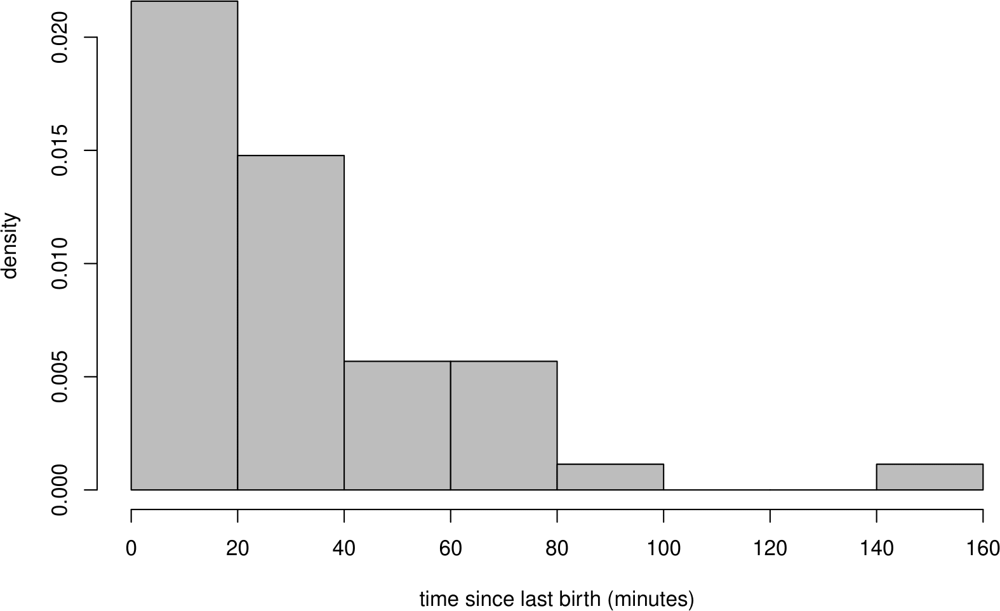
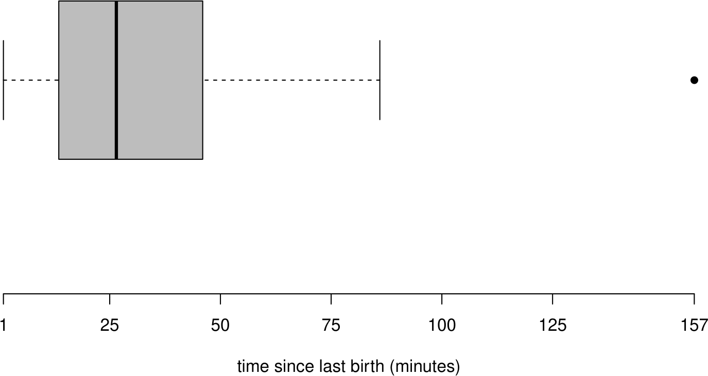
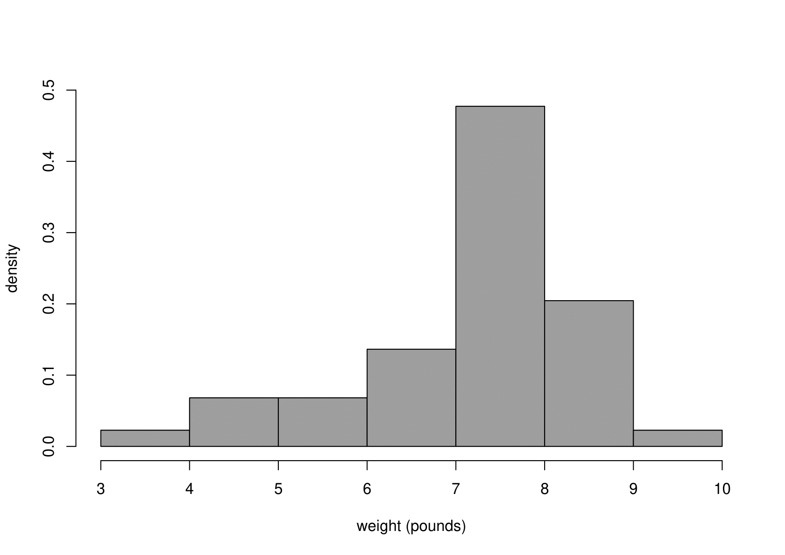

---
output:
  pdf_document: default
  html_document: default
---
```{r setup5, echo = FALSE, warning = FALSE, message = FALSE}

library(knitr)
library(dplyr)
library(huxtable)
options(
        huxtable.knit_print_df       = FALSE, 
        huxtable.add_colnames        = TRUE,  # needed when run by testthat
        huxtable.latex_use_fontspec  = TRUE,
        huxtable.bookdown            = TRUE
      )

#is_latex <- guess_knitr_output_format() == "latex"
## is_latex <- TRUE
#knitr::knit_hooks$set(
#  barrier = function(before, options, envir) {
#    if (! before && is_latex) knitr::asis_output("\\FloatBarrier")
#  }
#)
```

```{r, figsetup5, include=FALSE}
knitr::opts_chunk$set(
  fig.align = 'center',
  out.width = '75%'
)
```

```{r, echo = FALSE}
include_cropped_graphics <- function(x) {
#  knitr::include_graphics(knitr::plot_crop(x))
  knitr::include_graphics(x)
}
```

# Simple distributions {#simple}

We use a simple dataset to introduce some commonly-used simple distributions. We will study the **discrete** distributions: Bernoulli, binomial, geometric and Poisson. We will also study the **continuous** distributions: uniform, exponential, normal.

## Australian births data

Steele, S. (December 21, 1997), Babies by the Dozen for Christmas: 24-Hour Baby Boom, The Sunday Mail (Brisbane), page 7

According to this article, a record 44 babies (18 girls and 26 boys) were born in one 24-hour period at the Mater Mothers' Hospital, Brisbane, Australia, on 18th December 1997. The article listed the time of birth, the sex, and the weight in grams for each of the 44 babies.  These data are given in Table \@ref(tab:abirths).

```{r,echo = FALSE}
adat <- stat0002::aussie_births
amat <- matrix(NA, nrow = 12, ncol = 11)
for (i in 1:4) {
  amat[3 * (i - 1)  + 1, ] <- as.character(adat[1:11 + 11 * (i - 1), "time"])
  amat[3 * (i - 1)  + 2, ] <- as.character(adat[1:11 + 11 * (i - 1), "sex"])
  amat[3 * (i - 1)  + 3, ] <- as.character(adat[1:11 + 11 * (i - 1), "weight"])
}
rnames <- c("time", "sex", "weight")
amat <- cbind(rnames, amat)
```

```{r, echo=FALSE}
a_hux <- amat %>% 
  as_hux() %>%
  set_label("tab:abirths") %>%
  set_top_border(everywhere, everywhere, brdr(0.1, "solid", "black")) %>%
  set_bottom_border(everywhere, everywhere, brdr(0.1, "solid", "black")) %>%
  set_top_border(c(1, 4, 7, 10), everywhere, brdr(3, "double", "black")) %>%
  set_left_border(everywhere, -1, brdr(0.1, "solid", "black")) %>%
  set_right_border(everywhere, -12, brdr(0.1, "solid", "black")) %>%
  set_background_color(everywhere, everywhere, "white") %>%
  set_width(0.9) %>% 
  set_align(everywhere, everywhere, "center") %>% 
  set_number_format(everywhere, everywhere, 0) %>%
  set_bottom_padding(0) %>%
  set_top_padding(0) %>%
  set_caption("Australian births data.  Times are minutes since midnight.  Weights are in grams.")
a_hux    
```

Figure \@ref(fig:babyintro) summarises the birth times of boy and girl babies.

```{r echo=FALSE, babyintro, fig.show='hold', fig.cap='Birth times of babies on 18th December 1997 by sex.'}
include_cropped_graphics("images/baby_intro.png")
```

## The Bernoulli distribution

Consider the first birth.  The outcome is either a boy $B$ or a girl $G$.  We define a random variable 

\begin{equation}
X_1 =
\begin{cases} 
0 & \text{ if the first baby is a girl} \\
1 & \text{ if the first baby is a boy}.
\end{cases}
\end{equation}

$X_1$ is the outcome of a **Bernoulli trial**, that is, an experiment that has two possible outcomes.  Here, we have mapped the birth of a girl to the value 0 and the birth of a boy to the value 1.  This is arbitrary: we could have done this the other way round.

Let 
\begin{eqnarray*}
P(X_1=0)&=&1-p \\
P(X_1=1)&=&p. 
\end{eqnarray*}
Therefore,

\begin{equation}
X_1 =
\begin{cases} 
0 & \text{ with probability (w.p.)} \,\,1-p \\
1 & \text{ with probability (w.p.)} \,\,p.
\end{cases}
\end{equation}

$X_1$ has a Bernoulli distribution with parameter $p$, $(0 \leq p \leq 1)$, or, for short,
\[ X_1 \sim
\,\mbox{Bernoulli}(p). 
\]
Here, "$\sim$" means "is distributed as".

Similarly, we define the random variables
\begin{eqnarray*}
X_i &=& \left\{ \begin{array}{ll}0&\mbox{  if the $i$th baby is a girl}; \\
                                 1&\mbox{  if the $i$th baby is a boy,} \quad\mbox{for}\,\,\,i=1,\ldots,44.\end{array}\right.
\end{eqnarray*}
If we assume that the probability of a boy is the same for each birth then
\[ X_i \sim \mbox{Bernoulli}(p), \qquad \mbox{for}\,\,\,i=1,\ldots,44. \]

In this example the sample values $x_1, \ldots, x_{44}$ of $X_1,\ldots,X_{44}$ are
\[ x_1=0, \quad x_2=0, \quad x_3=1, \quad \ldots \quad x_{44}=0. \]

### Summary of the Bernoulli($p$) distribution

*  **Situation**: an experiment with exactly 2 possible outcomes (a Bernoulli trial), mapped to the values 0 and 1.
*  If $X$ is a discrete random variable with p.m.f.

\[ P(X=x) \,=\, p^x\,(1-p)^{1-x}, \qquad x=0,1, \]
for some $p$, $0 \leq p \leq 1$, then $X \sim \mbox{Bernoulli}(p)$.

*  Parameter: $p \in [0,1]$.
*  $\mbox{E}(X)=p$, $\mbox{var}(X)=p\,(1-p)$. (**Exercise**)

## The binomial distribution {#binomial}

We have seen that the 44 births are 44 Bernoulli trials.  We define a random variable $Y$ equal to the total number of boys in the 44 births, that is,
\[ Y = X_1 + X_2 + \cdots + X_{44} = \sum_{i=1}^{44} X_i. \]
We assume that the outcome of each birth is indepdendent of the outcomes of all the other births, that is, the random variables $X_1, \ldots, X_{44}$ are mutually independent. Therefore, we have assumed that $X_1, \ldots, X_{44}$ are independent and identically distributed, or i.i.d. for short.  `Identically distributed' means that $X_1, \ldots, X_{44}$ have exactly the same distribution, including the values of any unknown parameters.  We may write

\[ X_i \,\stackrel{{\rm i.i.d.}}{\sim}\, \mbox{Bernoulli}(p), \qquad i=1, ... , 44. \]
or
\[ X_i \,\stackrel{{\rm indep}}{\sim}\, \mbox{Bernoulli}(p), \qquad i=1, ... , 44. \]

$X_1, ... , X_{44}$ are a **random sample** from a Bernoulli($p$) distribution.

What is $P(Y=0)$?  

For $Y=0$ to occur we need all of the 44 births to be girls, that is,
\[ X_1=X_2=\cdots=X_{44}=0.\]  

We have assumed that the events $X_1=0, X_2=0, \ldots, X_{44}=0$ are independent of each other.  Using the multiplication rule for independent events gives
\begin{eqnarray*}
P(Y=0)&=&P(X_1=X_2=\cdots=X_{44}=0), \\
      &=&P(X_1=0) \times P(X_2=0) \times \cdots \times P(X_{44}=0), \\
      &=&(1-p) \times (1-p) \times \cdots \times (1-p), \\
      &=&(1-p)^{44}.
\end{eqnarray*}

What is $P(Y=1)$?  

For $Y=1$ to occur we need 43 girls and 1 boy to be born.  One way for this to happen is
\[ X_1=1, X_2=0, X_3=0, \ldots, X_{44}=0. \]
Under the assumption of independence, this combination of events has probability $p\,(1-p)^{43}$.
In fact, there are 44 different ways to get $Y=1$: the 1 boy could be born 1st, 2nd, 3rd, \ldots, 44th.
Therefore,
\[ P(Y=1) = 44\,p\,(1-p)^{43}. \]
We can continue this argument to find that
\[ 
P(Y=y)={44 \choose y} 
p^y\,(1-p)^{44-y}, \qquad y=0,1,\ldots,44. 
\]
The combinatorial term ${44 \choose y}={}^{44}C_y=\frac{44!}{(44-y)!y!}$ 
gives the number of ways in which $y$ boys births can be positioned amongst the 44 births.

$Y$ has a binomial distribution with parameters $44$ and $p$, $(0 \leq p \leq 1)$, or, for short,
\[ Y \sim \,\mbox{binomial}(44,p). \]
In this example the observed value of $Y$ is $y=26$.

As is usually the case, in this example we know the value of the first parameter, the number of trials, but we do not know the value of the second parameter, the probability $p$ that a trial results in a 1. Suppose that the 44 babies born on 18th December 2007 at this hospital in Brisbane are representative of babies from some wider population, perhaps the population of babies born (or to be born) in a December in Australia in the 21st century. We want to use these data to estimate the probability $p$ that a baby chosen randomly from this population is a boy, or equivalently, the proportion $p$ of babies in this population who are boys.

**Exercise**. We use $\hat{p} = 26/44$ as an estimate of $p$.  Why is this a sensible estimate?  

Putting a "hat" $\hat{}$ on a quantity indicates that the quantity is being estimated using data.  Here, $\hat{p}$ means "an estimate of $p$".

Figure \@ref(fig:babybinompmfs) shows the p.m.f.s of 4 binomial(44,$p$) distributions, for different values of $p$. One way to think about choosing an estimate of $p$ is to see for which value of $p$ the observed data are most likely.  In this case we have only one sample value, $y=26$.  Looking at Figure \@ref(fig:babybinompmfs) we can see that $y=26$ is very unlikely for $p=0.1$ and $p=0.9$, more likely for $p=0.5$ and even more likely for $p=\hat{p}$.  In addition to making sense because it is the observed proportion of boy babies, $\hat{p}$ has the property that the observed data are more likely for $p=\hat{p}$ than for any other value of $p$.

```{r echo=FALSE, babybinompmfs, fig.show='hold', fig.cap='Binomial($44,p$) p.m.f.s: $p=0.1$ (top); $p=1/2$ (second from top); $p=0.591$ (second from bottom); $p=0.9$ (bottom).  The sample value $y=26$ has been shaded in black.'}
include_cropped_graphics("images/binom_pmf1.png")
include_cropped_graphics("images/binom_pmf2.png")
include_cropped_graphics("images/binom_pmf3.png")
include_cropped_graphics("images/binom_pmf4.png")
```

### A brief look at statistical inference about $p$ {#binominf}

**This section of the notes is not part of STAT0002.  It introduces ideas surrounding hypothesis testing and confidence intervals.  If you take STAT0003 then you will cover these ideas in more detail.  This section is included because you may find it interesting to think about these ideas now.**

We have observed more boys than girls.  If $p=1/2$ we would expect roughly equal numbers of boys and girls. Even if it is true that $p=1/2$, we would only occasionally get equal numbers of boys and girls born on each day. We might like to quantify how unlikely is the event of a 26:18 split in 44 independent Bernoulli(1/2) trials. If this is very unlikely we might think that perhaps $p \neq 1/2$ after all. This is an example of **statistical inference**, that is, making an inference about the true value of $p$.  We will study statistical inference in Chapter \@ref(inference). 

In this example we might want to infer whether or not $p=0.5$.  We wish to judge whether the estimate $\hat{p}$ is far enough from 0.5 for us to conclude that $p \neq 0.5$.  We need to take into account how reliable (a term that we will use in Chapter \@ref(inference) is how **precise**) the estimation of $p$ is.  For a given true value of $p$ the larger the sample size $n$ (here $n = 44$) the greater the precision. If you take STAT0003 then you will study this in some detail.  Here, we introduce two main approaches to this problem.  They will seem rather similar, but there is a subtle difference.

#### 1. If $p=0.5$ then how surprising is $\hat{p}=0.591$? {-}

Suppose that the **null hypothesis** $H_0: p=0.5$ is true.  How unlikely it is that a sample of size $44$ produces an estimate of $p$ as far, or further from, 0.5 than $\hat{p}=0.591$?

You could think of this as 'standing' on the null hypothesis $H_0$ and looking to see how far away are the data.

If $p=0.5$, $P(Y \geq 26\mbox{ or }Y \leq 18) = 0.15+0.15=0.30$.  Figure \@ref(fig:binominf) illustrates the calculation of this probability. This (the value 0.30 here) is called a **$p$-value**. A $p$-value is a measure of our surprise at seeing the data if the null hypothesis is true.  The smaller the $p$-value the greater our surprise.  We could decide to reject the null hypothesis $H_0$ that $p=0.5$ if the $p$-value is sufficiently small.  Otherwise, we do not reject $H_0$. 

```{r echo=FALSE, binominf, fig.show='hold', fig.cap='A binomial($44,1/2$) p.m.f. with the probabilities satisfying $Y$ less than or equal to 18 or greater than or equal to 26 shaded in black.'}
include_cropped_graphics("images/binom_inference_1b.png")
```

A traditional cutoff for "sufficiently small" is 0.05, but it is not possible to argue that this is generally better than other choices of cutoff.  Based on this cutoff we would not reject $H_0$, because $0.3 > 0.05$.

#### 2. Is $p=0.5$ plausible based on inferences made about $p$ using the data? {-}

We estimate $p$ and then see how close the estimate is to 0.5.  In this example $\hat{p}=26/44=0.591$. To quantify whether this is significantly different from 0.5 we can calculate an interval estimate of $p$, called a **confidence interval**, and see whether or not this interval contains 0.5.  If it does not contain 0.5 then we could decide to reject the null hypothesis $H_0$ that $p=0.5$. Otherwise, we do not reject $H_0$.

You could think of this as 'standing' on the data and looking to see how far away is the null hypothesis $H_0.$

A confidence interval is a realisation (the observed value) of a random interval that has a certain probability of covering the true value of $p$.  The interval is random because before we collect the data we do not know what the interval will be. For example, A 95\% confidence interval for $p$ has a probability of 0.95 of covering the true value of $p$. 

An approximate 95\% confidence interval for $p$ based on these data is $(0.45,0.74)$ which does contain 0.5.  Therefore, we do not reject $H_0$.  You can think of a 95\% confidence interval as a range of values of $p$ that are consistent with the data, in the sense that we would not reject $H_0: p = p_0$ for any $p_0$ contained in this interval if we used approach 1. above with a cutoff of 0.05.

In modern Statistics method 2. (**interval estimation**) is often preferred to 1. (**hypothesis testing**) because it gives an interval estimate for $p$ rather than just a decision of whether or not to reject $H_0: p=0.5$.

### Summary of the binomial($n,p$) distribution

*  **Situation**: the number of 1s in $n$ independent Bernoulli trials, 
each trial having the same probability $p$ of obtaining a 1.
*  If $Y$ is a discrete random variable with p.m.f.
\[ P(Y=y) \,=\, {n \choose y} p^y\,(1-p)^{n-y}, \qquad y=0,1,\ldots,n, \]
for some $p$, $0 \leq p \leq 1$, then $Y \sim \mbox{binomial}(n,p)$.
*  Parameters: $n$ (usually known) and $p \in [0,1]$.
*  $\mbox{E}(Y)=n\,p$, $\mbox{var}(Y)=n\,p\,(1-p)$. (**Exercise**. Note that $Y=X_1 + \cdots + X_n$, where $X_i, i=1, \ldots, n$ are independent Bernoulli($p$) random variables.)

A binomial(1,$p$) distribution is the same as a Bernoulli($p$) distribution.

## The geometric distribution

The ordering of the arrivals of the boy and girl babies is 
\[ G G B B B G G B B B B B G G B G G B B B B G G G G B B B G B G B B B B B G B B B B G G G \]

Suppose that are interested in the arrival of the 1st baby boy.  We define the random variable $W_1$ to be the number of births up to and including the birth of the 1st boy. In the current example, the 1st boy is born on the 3rd birth, so the sample value of $W_1$ is $w_1=3$.

Now we define $W_2$ to be the number of births, after the birth of the 1st boy, up to and including the birth of the 2nd boy.  In this example the sample value of $W_2$ is $w_2=1$.

Similarly, we define $W_i$ to be the number of births, after the birth of the $(i-1)$th boy, up to and including the birth of the $i$th boy.  

This leads to values $w_1, w_2, \ldots, w_{26}$:
\[ 3, 1, 1, 3, 1, 1, 1, 1, 3, 3, 1, 1, 1, 5, 1, 1, 2, 2, 1, 1, 1, 1, 2, 1, 1, 1 \]
The last 3 observations ($GGG$) do not contribute here because we do not know when the next boy arrived.  The frequencies of these values appear in column 2 of Table \@ref(tab:geom).  In column 4 we have divided these **observed frequencies** by 26 to obtain the **relative frequencies**.  We explain the contents of columns 3 and 5 of this table later.

```{r, echo = FALSE}
sex <- stat0002::aussie_births$sex
# Find the numbers of births that we wait for each boy to arrive
temp <- diff(c(0, which(sex == "boy")))
# Add dummy values to make sure that zero frequencies appear
temp <- c(1:(max(temp) + 1), temp)
# Table of frequencies
geom_freq <- table(temp) - 1             
names(geom_freq)[6] <- "6+"

obs_freq <- as.numeric(geom_freq)
rel_freq <- obs_freq / sum(obs_freq)

# Estimated probabilities 
# R's dgeom function is based on the number of failures before the 
# first success, not the number of trials.  Therefore, we subtract 1 below.
phat <- mean(sex == "boy")
est_prob <- dgeom((1:5) - 1, prob = phat)
# Add the estimates probability of 6 or more births
est_prob <- c(est_prob, 1 - sum(est_prob))

# Estimated expected frequencies
exp_freq <- 26 * est_prob

geom_df <- round(cbind(1:6, obs_freq, exp_freq, rel_freq, est_prob), 3)
```

```{r, echo=FALSE}
geom_hux <- geom_df %>% 
  as_hux() %>%
  insert_row("number of births", "observed", "estimated expected", "relative", "estimated", after = 0) %>%
  insert_row("until boy born", "frequency", "frequency", "frequency", "probability", after = 1) %>%
  set_contents(8, 1, "6+") %>%
  set_label("tab:geom") %>%
  set_right_padding(-c(1, 2), 3, 60) %>% 
  set_align(everywhere, everywhere, "center") %>% 
  set_align(-c(1,2), 3, ".") %>%
  set_top_border(3, everywhere, brdr(0.1, "solid", "black")) %>%
  set_top_border(-3, everywhere, brdr(0.1, "solid", "white")) %>%
  set_left_border(everywhere, -c(1, 6), brdr(0.1, "solid", "black")) %>%
  set_background_color(everywhere, everywhere, "white") %>%
  set_width(0.9) %>% 
  set_number_format(everywhere, 3:5, 2) %>%
  set_bottom_padding(0) %>%
  set_top_padding(0) %>%
  insert_row("total", "26", "26", "1", "1", after = 8) %>%        
  set_bottom_border(8, everywhere, brdr(0.1, "solid", "black")) %>%
  set_number_format(9, 3:5, 0) %>%
set_caption("Observed frequencies and relative frequencies and their fitted values under a geometric(0.591) distribution.")
geom_hux    
```

**Question**: Why have I written '$\geq$ 6' in the first column of Table \@ref(tab:geom) rather than '6'?

The observed frequencies are plotted in Figure \@ref(fig:geombar).

```{r echo=FALSE, geombar, fig.show='hold', fig.cap='Bar plot of numbers of births between successive baby boys (including the next baby boy).'}
include_cropped_graphics("images/baby_geom_bar.png")
```

Now we find the probability distribution of $W_1, W_2, \ldots$. First we consider $W_1$. Recall that the outcomes $X_1,\ldots,X_{44}$ of the 44 births are assumed to be independent Bernoulli trials.

What is $P(W_1=1)$?.  

For $W_1=1$ to occur we need the next birth to be a boy. Therefore, $P(W_1=1)=p$.

What is $P(W_1=2)$?.  

For $W_1=2$ to occur we need a girl followed by a boy.  Therefore, $P(W_1=2)=(1-p)\,p$.

We can continue this argument to find

\begin{equation}
P(W_1=w) = (1-p)^{w-1}\,p, \qquad w=1,2,\ldots.  
(\#eq:geom)
\end{equation}

$W_1$ has a geometric distribution with parameter $p$, $(0 < p \leq 1)$, or, for short,
\[ W_1 \sim \mbox{geometric}(p). \]
We exclude $p=0$ because in this case we would never get a 1 and the \@ref(eq:geom) would sum to zero not one.

Since $W_2$ relates to exactly the same situation as $W_1$, that is, the number of births until the next boy is born, $W_2$ has the same distribution as $W_1$. (We may write $W_1 \,\stackrel{{\rm d}}{=}\, W_2$ for "$W_1$ has the same distribution as $W_2$".) Similarly $W_3,W_4,\ldots$ also have the same distribution as $W_1$.

The outcomes of the births are assumed to be mutually independent.  
\[ W_i \,\stackrel{{\rm i.i.d.}}{\sim}\, \mbox{geometric}(p), \qquad i=1,\ldots,26. \]
$W_1, \ldots, W_{26}$ are a **random sample** from a geometric($p$) distribution.

We do not know the value of $p$ but we have an estimate $\hat{p}=26/44$ of $p$.  We substitute this estimate of $p$ into equation \@ref(eq:geom) to calculate the **estimated probabilities** in column 5 of Table \@ref(tab:geom).
Multiplying the estimated probabilities by 26 gives the **expected** frequencies in column 3.  That is,

Estimated probabilities: $(1-\hat{p})^{w-1}\,\hat{p}, \quad w=1,2,\ldots.$

Estimated expected frequencies: $26 \times (1-\hat{p})^{w-1}\,\hat{p}, \quad w=1,2,\ldots.$

Figure \@ref(fig:geomfit) shows that the observed and estimated expected frequencies are in reasonably close agreement. We do not expect exact agreement.  Formal methods for assessing how closely observed and estimated expected frequencies agree are not part of STAT0002.  Figure \@ref(fig:geomfit) also shows the general shape of the geometric distribution.  It is positively skewed.

```{r echo=FALSE, geomfit, fig.show='hold', fig.cap='Observed frequencies and estimated expected frequencies under a geometric(0.591) distribution.'}
include_cropped_graphics("images/baby_geom_fit.png")
```

### Summary of the geometric($p$) distribution

* **Situation**: the number of trials up to and including the first value of 1 in a sequence of independent Bernoulli trials, each trial having the same probability $p$ of obtaining a 1.
*  If $W$ is a discrete random variable with p.m.f.
\[ P(W=w) \,=\, (1-p)^{w-1}\,p, \qquad w=1,2,\ldots \]
for some $p$, $0 < p \leq 1$, then $W \sim \mbox{geometric}(p)$.
*  Parameter: $p \in (0,1]$.
*  $\mbox{E}(W)=\displaystyle\frac1p$, $\mbox{var}(W)=\displaystyle\frac{1-p}{p^2}$. (**Exercise**)

An alternative formulation is where a random variable $V$ is defined as the number of trials performed **before** the first 1 occurs.  Therefore, the support of $V$ is $0, 1, 2, ...$ and $V = W - 1$. The `dgeom()` function in R relates to a random variable like $V$, not $W$. 

## The Poisson distribution {#Poisson}

Now we look at the numbers $N_1, \ldots, N_{24}$ of births that occur in each hour of the 24 hours on the day December 18, 1997.  This produces a **count** for each hour.  We have split the 24-hour period into 24 time periods of the same length.  We could equally have chosen to split it into 12 time periods, each of length 2 hours. 

The frequencies of these counts appear in column 2 of Table \@ref(tab:pois).  In column 4 we have divided these **observed frequencies** by 24 to obtain the **relative frequencies**.  We explain the contents of columns 3 and 5 of this table later.

```{r, echo = FALSE}
time <- stat0002::aussie_births$time
# Hour of birth
temp <- floor(time /60) + 1
temp <- table(c(c(0:max(temp), temp))) - 1
pois_freq <- table(c(1:(max(temp) + 1), temp)) - 1
names(pois_freq)[6] <- "5+"
obs_freq <- as.numeric(pois_freq)
rel_freq <- obs_freq / sum(obs_freq)
# Estimated probabilities 
muhat <- 44/24
pois_fit <- dpois(0:4, muhat)
est_prob <- c(pois_fit, 1 - sum(pois_fit))
exp_freq <- est_prob * 24
pois_df <- round(cbind(0:5, obs_freq, exp_freq, rel_freq, est_prob), 3)
```

```{r, echo=FALSE}
pois_hux <- pois_df %>% 
  as_hux() %>%
  insert_row("number of births", "observed", "estimated expected", "observed", "estimated", after = 0) %>%
  insert_row("in 1 hour", "frequency", "frequency", "proportion", "probability", after = 1) %>%
  set_contents(8, 1, "5+") %>%
  set_label("tab:pois") %>%
  set_right_padding(-c(1, 2), 3, 60) %>% 
  set_align(everywhere, everywhere, "center") %>% 
  set_align(-c(1,2), 3, ".") %>%
  set_top_border(3, everywhere, brdr(0.1, "solid", "black")) %>%
  set_top_border(-3, everywhere, brdr(0.1, "solid", "white")) %>%
  set_left_border(everywhere, -c(1, 6), brdr(0.1, "solid", "black")) %>%
  set_background_color(everywhere, everywhere, "white") %>%
  set_width(0.9) %>% 
  set_number_format(everywhere, 3:5, 2) %>%
  set_bottom_padding(0) %>%
  set_top_padding(0) %>%
  insert_row("total", "24", "24", "1", "1", after = 8) %>%        
  set_bottom_border(8, everywhere, brdr(0.1, "solid", "black")) %>%
  set_number_format(9, 3:5, 0) %>%
set_caption("Observed frequencies and relative frequencies and their fitted values for a Poisson(1.83) distribution.")
pois_hux    
```

The observed frequencies are plotted in Figure \@ref(fig:poisbar).

```{r echo=FALSE, poisbar, fig.show='hold', fig.cap='Bar plot of numbers of births in each hour of the 24 hours of December 18, 1997.'}
include_cropped_graphics("images/baby_pois_bar.png")
```

We make assumptions about the way in which the births occur over time.  Suppose that births occur 

*  one at a time
*  independently of each other
*  uniformly, that is, at a constant rate $\lambda$ per hour
*  randomly.

This is an informal description of a **Poisson process** of rate $\lambda$.

It can be shown (STAT0007) that if births arrive in a Poisson process of rate $\lambda$ per hour then the number of births that occur in a time
interval of length $h$ hours has a particular kind of distribution called a Poisson distribution with mean $\mu=\lambda h$.  In our example, we have $h=1$, because we have counted the number of births that occur in time periods of length 1 hour.

Consider $N_1$, the number of births in the first hour.  Under the assumptions of the Poisson process, $N_1$ has a Poisson distribution with mean parameter $\lambda$, ($\lambda >0$), or, for short,
$$N_1 \sim \mbox{Poisson}(\lambda).$$  
The probability mass function (p.m.f.) of $N_1$ is given by
\begin{equation}
P(N_1=n) = \frac{\lambda^n\,e^{-\lambda}}{n!}, \qquad n=0,1,2,\ldots. (\#eq:pois)
\end{equation}

These arguments also apply to $N_2, N_3, ... , N_{24}$.  Therefore,
\[ N_i \,\stackrel{{\rm i.i.d.}}{\sim}\, \mbox{Poisson}(\lambda), \qquad i=1,\ldots,24, \]
that is, $N_1,\ldots,N_{24}$ are a random sample from a Poisson ($\lambda$) distribution.

The sample values $n_1, n_2, \ldots, n_{24}$ of $N_1, N_2, \ldots, N_{24}$ are
\[ n_1=1, \quad n_2=3, \quad \ldots, \quad n_{24}=2. \]

We do not know the value of $\lambda$, but we can estimate it using $\hat{\lambda} = 44 / 24 \approx 1.83$ births per hour.  

**Exercise**. Why is this a sensible estimate of $\lambda$?

We substitute this estimate of $\lambda$ into equation \@ref(eq:pois) to calculate the estimated probabilities in column 5 of Table Table \@ref(tab:pois). Multiplying the estimated probabilities by 24 gives the estimated expected frequencies in column 3.  That is,

Estimated probabilities: $\displaystyle\frac{\hat{\lambda}^n\, e^{-\hat{\lambda}}}{n!}, \quad n=0,1,2,\ldots.$

Estimated expected frequencies: $24 \times \displaystyle\frac{\hat{\lambda}^n\,e^{-\hat{\lambda}}}{n!}, \quad n=0,1,2,\ldots.$

Figure \@ref(fig:poisfit) shows that the observed and estimated expected frequencies 
are in reasonably close agreement.

```{r echo=FALSE, poisfit, fig.show='hold', fig.cap='Observed frequencies and the estimated expected frequencies under a Poisson(1.83) distribution.'}
include_cropped_graphics("images/baby_pois_fit.png")
```

Figure \@ref(fig:poispmfs) shows 3 different Poisson p.m.f.s.   As $\lambda$ increases the Poisson p.m.f. becomes increasingly symmetric.  The middle plot shows the p.m.f. of the Poisson distribution we have fitted to the hourly baby totals.  This plot has approximately the same shape as the frequency distribution of hourly baby totals in Figure \@ref(fig:poisbar).

```{r echo=FALSE, poispmfs, fig.show='hold', fig.cap='Poisson p.m.f.s: mean = 0.5 (top); mean = 1.83 (middle); mean = 5 (bottom).'}
include_cropped_graphics("images/poisson_pmf1.png")
include_cropped_graphics("images/poisson_pmf2.png")
include_cropped_graphics("images/poisson_pmf3.png")
```

### Summary of the Poisson($\mu$) distribution

*  Situation: the number events occurring during a time period of fixed duration.
*  If $N$ is a discrete random variable with p.m.f.
\[ P(N=n) = \frac{\mu^n\, e^{-\mu}}{n!}, \qquad n=0,1,2,\ldots, \]
for some $\mu$, then $N \sim \mbox{Poisson}(\mu)$.
*  Parameter: $\mu > 0$. 

[$\mu = 0$ is valid but  not interesting: $P(N = 0) = 1$.]

*  $\mbox{E}(N)=\mu$, $\mbox{var}(N)=\mu$.

## Summary of these discrete distributions

We have studied 4 common discrete distributions:

* **Bernoulli**. A single trial with a binary outcome (0/1 variable).
* **binomial**: The total number of 1s in a sequence of independent and Bernoulli trials, with a common probability of obtaining a 1.  
* **geometric**: The number of independent Bernoulli trials, with a common probability of obtaining a 1, until the first 1 is obtained.
* **Poisson**: used for counts of events that arrive in a Poisson process.

## The uniform distribution {#uniform}

Now suppose that we are interested in the **times** at which the babies are born. Previously we assumed that births occur in a Poisson process: singly, independently and randomly at a constant rate.

If, as we have assumed, births occur in a Poisson process, that is, singly, independently and randomly at a constant rate, we would expect the times of birth to be scattered randomly over the interval (0, 24) hours.  We would not expect all the births to be between, for example, 12h and 18h.  However, births should not be regularly spaced: there will be periods of time when there are large numbers of births, and other periods of time when there are only small numbers.  At first glance, the times of birth in Figure \@ref(fig:babyintro) do appear to be approximately consistent with being randomly scattered over (0, 24) hours.

Consider a single birth chosen at random from the 44 births.  Let $U_1$ be the time, in hours since midnight, of birth of this baby.  We know that this birth occurred somewhere in the time interval (0,24). Therefore, $0 < U_1 < 24$.  All births are assumed to occur at a constant rate over (0,24).  Therefore, this birth is no more likely to have occurred at a particular time in (0,24) than at any other time.  In other words, the time of this birth is equally likely to lie anywhere in the interval (0,24). Since time is continuous $U_1$ is a continuous random variable. 

The discussion above should make it clear that, if births occur in a Poisson process, the p.d.f. of $U_1$ is given by
\[ f_{U_1}(u) = \frac1{24}, \qquad 0 < u < 24. \]
This p.d.f. is plotted in Figure \@ref(fig:unifpdf).

```{r echo=FALSE, unifpdf, fig.show='hold', fig.cap='The p.d.f. of a U(0, 24) distribution.'}
include_cropped_graphics("images/unif_pdf.png")
```

This is the p.d.f. of a (continuous) uniform distribution over the interval (0,24), or, for short,
\[ U_1 \sim \mbox{U}(0,24). \]  
A uniform  distribution is sometimes called a rectangular distribution.  The uniform distribution has 2 parameters: the lower and upper end points of the interval over which it is defined.  In this example the values of both the parameters are known.

Suppose that we choose another time of birth $U_2$ from the remaining 43 births. The arguments we made about $U_1$ apply equally to $U_2$.  Therefore $U_2 \sim \mbox{U}(0,24)$.  Similarly $U_3, U_4, \ldots, U_{44} \sim \mbox{U}(0,24)$.  The assumption that the births occur independently of each other means that 
\[ U_i \,\stackrel{{\rm i.i.d.}}{\sim}\, \mbox{U}(0,24), \qquad i=1,\ldots,44, \]
that is, $U_1,\ldots,U_{44}$ are a random sample from a $\mbox{U}(0,24)$ distribution.

How else (in addition to looking at Figure \@ref(fig:babyintro)) can we examine whether the sample times of birth $u_1, \ldots, u_{44}$ look like a random sample from a $\mbox{U}(0,24)$ distribution?  

One way is to look at a histogram of the times of birth to see whether it is approximately flat.  Figure \@ref(fig:unifhists) shows 4 histograms, with different bin widths. Although the shape of the histogram changes slightly depending on the choice of bin width, all the plots suggest that there are are greater numbers of births in the afternoon and early evening periods than at other times. Another way is to look at a **uniform QQ plot**. We do this in Section \@ref(qq).

```{r echo=FALSE, unifhists, fig.show='hold', fig.cap='Histograms of times of birth, with U(0,24) p.d.f. superimposed.'}
include_cropped_graphics("images/baby_unif_hist_freq.png")
```

**Exercise**. Why might births not occur at the same rate throughout the day?

### Summary of the uniform($a,b$) distribution

*  **Situation**: a continuous random variable for which all values between $a$ and $b$ are equally likely.
*  If $U$ is a continuous random variable with p.d.f.
\[ f_{U}(u) \,=\, \frac{1}{b-a}, \qquad a < u < b, \]
for $b > a$, then $U \sim \mbox{U}(a,b)$.
*  Parameters: $-\infty < a < b < \infty$.
*  $\mbox{E}(U)=\displaystyle\frac{a+b}{2}$, $\mbox{var}(U)=\displaystyle\frac{(b-a)^2}{12}$.

## The exponential distribution {#exponential}

Now suppose that we are interested in the length of time $T_1$ until the
first birth.  Look at Table \@ref(tab:abirths).  In this example the observed value $t_1$ of $T_1$ is 5 minutes.  

It can be shown (STAT0007) that if the times of birth form a Poisson process of rate $\lambda$ per hour then the continuous random variable $T_1$ has p.d.f.
\[ f_{T_1}(t) = \lambda\,e^{-\lambda t}, \qquad t \geq 0. \]
$T_1$ has exponential distribution with parameter $\lambda$, or, for short,
\[ T_1 \sim \mbox{exp}(\lambda). \]
Let $T_2$ be the time between the 1st birth and the 2nd birth; and $T_3$ be the time between the 2nd birth and the 3rd birth; and so on.  Observed values $t_2$ and $t_3$ of $T_2$ and $T_3$ are $t_2$=59 minutes and $t_3$=14 minutes.

Figure \@ref(fig:babyexpplots) shows a histogram and boxplot of these sample values. The distribution of the times between the events is clearly positively skewed.

```{r echo=FALSE, babyexpplots, fig.show='hold', fig.cap='Histogram (left) and boxplot (right) of the sample times between births.', out.width = '45%'}


```

It can be shown (STAT0007) that if the times of birth form a Poisson process
of rate $\lambda$ per hour then 
\[ T_i \,\stackrel{{\rm i.i.d.}}{\sim}\, \mbox{exponential}(\lambda), \qquad i=1,\ldots,44, \]
that is, $T_1,\ldots,T_{44}$ are a random sample from an $\mbox{exponential}(\lambda)$ distribution.  

There is more than one to estimate $\lambda$.  One approach is to note that the parameter $\lambda$ here is the same as the parameter $\lambda$ in Section \@ref(Poisson).  Therefore, we could the estimate $\hat{\lambda}=44/24\approx 1.83$ births per hour.  

Alternatively, we could use the fact that the mean of an $\mbox{exponential}(\lambda)$ distribution is $1/\lambda$.  The sample mean of the 44 times $t_1,\ldots,t_{44}$ between births is 
\[ \frac{\displaystyle\sum_{i=1}^{44}t_i}{44}=\frac{\mbox{time of last birth}}{44}=\frac{1435}{44}\approx 32.61 \mbox{~minutes} 
\approx 0.543 \mbox{~hours}. \]
Rearranging
\[ \mbox{E}(T) = \frac{1}{\lambda}, \]
gives
\[ \lambda = \frac{1}{{\rm E}(T)}. \]
Therefore a sensible estimate of $\lambda$ is given by
\[ \tilde{\lambda} = \frac{1}{0.543} \approx 1.840 \mbox{ births per hour}. \]
We have used $\tilde{\lambda}$ to denote the estimate of $\lambda$ to distinguish it from $\hat{\lambda}$.

How well does the exponential distribution fit these data?  We could compare an estimate of the p.d.f. from a histogram of the data with the fitted exponential($\hat{\lambda}$) p.d.f. or look at an **exponential QQ plot** (see Section \@ref(qq)).  Figure \@ref(fig:exppdf) enables us to do the former.  This plot suggests that the exponential distribution fits the data well.

```{r echo=FALSE, exppdf, fig.show='hold', fig.cap='Histogram of sample inter-birth times with superimposed p.d.f. of an exponential(1.840) distribution.'}
include_cropped_graphics("images/baby_exp_hist_dens.png")
```

#### Three ways to check the Poisson process assumption {-}

We have used the data in three different ways (based on the Poisson, uniform and exponential distributions) to check same assumption: that the births occur in a Poisson process.  It is possible that one check suggests that this assumption is reasonable but another suggests that it is not.  For example, if the births were regularly spaced (e.g. one birth exactly every half hour) then a histogram would look flat, or very close to being flat, depending a little on the bin width. However, the times between births are equal and therefore do not look at all like a random sample from an exponential distribution.  The numbers of births in each of the 24 hours will not look like a random sample from Poisson distribution: they will be much less variable than they should be.  The moral of this story: the fact that the particular way you have chosen to assess the fit of your distribution looks OK does not imply that the distribution is true.  Another way to assess the fir might reveal a big problem.

**Exercise**. Based on the exponential distribution that we fitted to the Australian births data, what is the probability that the time gap between 2 births is longer than 90 minutes?

### Summary of the exponential($\lambda$) distribution

*  A situation in which this distribution arises: 
    - the time until the first event in a Poisson process of rate $\lambda$
    - and the times between events in a Poisson process of rate $\lambda$
*  If $T$ is a continuous random variable with p.d.f.
\[ f_{T}(t) = \lambda\,e^{-\lambda t}, \qquad t \geq 0, \]
for $\lambda > 0$, then $T \sim \mbox{exponential}(\lambda)$.
*  Parameters: $\lambda > 0$.
*  $\mbox{E}(T)=\displaystyle\frac{1}{\lambda}$, $\mbox{var}(T)=\displaystyle\frac{1}{\lambda^2}$.

## The normal distribution {#normal}

Suppose now that we are interested in the birth weights $Z_1,\ldots,Z_{44}$ of the babies.  Figure \@ref(fig:babynormalplots) shows a histogram and a boxplot of the of the sample birth weights $z_1,\ldots,z_n$.  I have converted the weights from grams to pounds (1 pound $\approx$ 453.5g).

```{r echo=FALSE, babynormalplots, fig.show='hold', fig.cap='Histogram (left) and boxplot (right) of the sample birth weights.', out.width = '45%'}

knitr::include_graphics("images/baby_normal_box.png")
```

The most obvious feature of figure \@ref(fig:babynormalplots) is that the empirical distribution of birth weights is not symmetric.  The data are negatively skewed. The tail of light babies on the left is longer than the tail of heavy babies on the right. This could be the result of some babies being born prematurely or with a condition that tends to lower birth weight.

A distribution that is commonly used to model continuous variables such as weight is the normal distribution.  This is also known as the Gaussian distribution.  A continuous random variable $Z$ has a normal distribution with parameters $\mu$ and $\sigma^{2}$ if its probability density function is given by
\[ f_Z(z) = \displaystyle\frac{1}{\sigma\sqrt{2\pi}} \,\exp\!\left[ -\,\frac{1}{2\sigma^2}
(z-\mu)^{2} \right],
\qquad \mbox{for}\,\,\,-\infty < z < \infty. \]
We write 
\[ Z \sim \mbox{N}(\mu,\sigma^{2}). \]

The p.d.f. of a normal distribution is sometimes described as 'bell-shaped' as in the top left plot in Figure \@ref(fig:shapes).

One of the key properties of the normal distribution is that its p.d.f. is symmetric about its mean $\mu$. Therefore, the plots in Figure \@ref(fig:babynormalplots) suggest that it may not be reasonable to suppose that the birth weights of these babies behave like a random sample from a normal distribution. 

Nevertheless, we consider how we could to fit a normal distribution to these data - even though it does not appear that a normal distribution is appropriate in this case.

It makes sense to estimate

* the mean of a distribution by the sample mean;
* the variance of a distribution by the sample variance. 

In this example we get 
\[ \hat{\mu}=7.22 \mbox{ pounds} \qquad \mbox{and} \qquad \hat{\sigma}^2=1.36 \mbox{ pounds}^2. \]

In Figure \@ref(fig:normalpdf) the fitted normal $\mbox{N}(\hat{\mu},\hat{\sigma}^{2})$ p.d.f. superimposed on the histogram of the sample birth weights. 

```{r echo=FALSE, normalpdf, fig.show='hold', fig.cap='Histogram of sample birth weights, with a fitted normal p.d.f. superimposed.'}
include_cropped_graphics("images/baby_normal_fitnew.png")
```

As we expect the fit if not particularly good.  In particular, there are more low birth weight babies than we would expect based on the fitted normal distribution.  In Section \@ref(qq) we will use a **normal QQ plot** to assess the fit of a normal distribution to these data.

### Summary of the $\mbox{N}(\mu,\sigma^2)$ distribution

* Situation: used widely in Statistics 
    - to model continuous variables, perhaps after transformation;
    - as a model for measurement error;
    - (under certain conditions) as an approximation to other random variables;
    - as a model for data that can be viewed as sums or averages of a large number of random variables (owing to the Central Limit Theorem).
* If $Z$ is a continuous random variable with p.d.f.
\[ f_Z(z) = \displaystyle\frac{1}{\sigma\sqrt{2\pi}} \,\exp\!\left[ -\,\frac{1}{2\sigma^2}
(z-\mu)^2 \right],
\,\, \mbox{for}\,-\infty < z < \infty, \]
for $\sigma >0$, then $Z \sim \mbox{N}(\mu,\sigma^{2})$.
* Parameters: $-\infty < \mu < \infty$, $\sigma^2 > 0$.
* $\mbox{E}(Z)=\mu$, $\mbox{var}(Z)=\sigma^2$.

### The standard normal disribution

The $N(0,1)$ distribution is called the **standard normal** distribution. We write $\phi(x)$ for its p.d.f. and $\Phi(x)$ for its c.d.f., so that 
\[ \phi(x)=\frac{1}{\sqrt{2\pi}} \,{\rm e}^{-\frac{1}{2}\,x^{2}}, \quad -\infty < x < \infty, \]
and 
\[ \Phi(x) =
\int_{-\infty}^{x} \displaystyle\frac{1}{\sqrt{2\pi}} \,{\rm e}^{-\frac{1}{2}\,t^{2}} {\rm ~d}t, \quad 
\quad -\infty < x < \infty. \]

### Evaluating the the normal c.d.f. and quantiles

Suppose that $W \sim N(7.22, 1.36)$, that is, $\mbox{E}(W)=7.22$ and $\mbox{var}(W)=1.36$ and we want to calculate $P(W \leq 10)$.  Then

$$
\begin{aligned}
P(W \leq 10) = \int_{-\infty}^{10} \displaystyle\frac{1}{1.36\sqrt{2\pi}} 
\,\exp\!\left[ -\,\frac{1}{2\times 1.36}(w-7.22)^2 \right] {\rm ~d}w. 
\end{aligned}
$$

It is not possible to express this integral in terms of simple functions. Instead, numerical algorithms are used to calculate its value.  In R the function `pnorm()` does this.

Historically, that is, before the advent of modern computing, a probability like this was evaluated by noting that if $W \sim N(\mu, \sigma^2)$ then $Z = \displaystyle\frac{W - \mu}{\sigma} \sim N(0, 1)$.  Then the following calculation was performed.

$$
\begin{aligned}
P(W \leq 10)
&= P\left(\frac{W-7.22}{\sqrt{1.36}} \leq \frac{10-7.22}{\sqrt{1.36}} \right) \\
&\approx P\left(Z \leq 2.38 \right) \qquad\qquad \mbox{where } Z \sim N(0, 1) \\
&= \Phi(2.38)
\end{aligned}
$$

Then the value of $\Phi(2.38)$ was found in a book of statistical tables.  Now it is easier to use R.

```{r}
value <- (10 - 7.22) / sqrt(1.36)
pnorm(value)
```

We can get even R to do the standardisation to the N(0, 1) case for us.

```{r}
pnorm(10, mean = 7.22, sd = sqrt(1.36))
```

Suppose now that we want to find the 95\% quantile of $W$, that is, $w$ for which $P(W \leq w) = 0.95$.  If we standardise $W$ to $Z$ as above then we find that $w = 7.22 + \sqrt{1.36}\,\Phi^{-1}(0.95)$.  The `qnorm()` function calculates the inverse c.d.f. $\Phi^{-1}$ (or quantile function).

```{r}
value <- (10 - 7.22) / sqrt(1.36)
7.22 + sqrt(1.36) * qnorm(0.95)
```

```{r}
qnorm(0.95, mean = 7.22, sd = sqrt(1.36))
```

### Interpretation of $\sigma$

Suppose that $X \sim N(\mu,\sigma^{2})$.  Let $p_k = P(|X-\mu| < k\sigma)$, so that $p_k$ is the probability that $X$ lies within $k$ standard deviations of its mean.  We have $p_1 = 0.6826$, $p_2 = 0.9545$ and $p_3 = 0.9973$.  Therefore, for a large sample from a normal distribution 
approximately 68\% of observations will fall within 1 standard deviation of the mean, and approximately 95\% within 2 standard deviations of the mean. 

## QQ plots {#qq}

We have seen that we can use a plot, for example, a histogram to examine the shape of the frequency distribution of data.  Sometimes we are interested in deciding whether the data appear to have come from a particular distribution, with a particular shape.  

For example, many traditional statistical methods are based on an assumption that the data come from a normal distribution. It can be fairly easy to see from a plot whether the data appear to be symmetric or skewed, but judging whether whether a plot of the data has approximately the characteristic bell-shape of a normal distribution may be more difficult.

Another way to compare the distribution of a sample with a particular distribution is to use a **quantile-quantile plot** or **QQ plot** for short.  This plot is based on comparing sample quantiles (Section \@ref(fivenumber)) and theoretical quantiles (Section \@ref(quantiles)).  The following example is based on a normal distribution, but a QQ plot can be based on any **continuous** distribution.

### Normal QQ plots

Before we describe how to produce a QQ plot we return to the Oxford birth times example. The sample quartiles ($q_L, m, q_U$) are 4.95, 7.50, and 9.75 hours.  Also, the sample mean is 7.72 hours and the sample standard deviation is 3.57 hours.  We suppose that these data have been sampled from a normal distribution with a mean of 7.72 hours and a standard deviation of 3.57 hours.  We calculate the (theoretical) quartiles of this normal N(7.72,3.57$^2$) distribution and compare them in Table \@ref(tab:compareqs) to the sample quartiles of Oxford births data.

|       | $q_L$ | $m$ | $q_U$ |
|:------:|------:|-------:|------:|
| sample | $4.95$ | $7.50$ | $9.75$ | 
| $N(7.72, 3.57^2)$ | $5.32$ | $7.72$ | $10.13$ | 

Table: (\#tab:compareqs) Comparison of sample and theoretical quantiles.

If the data have been sampled from $N(7.72, 3.57^2)$ distribution the values in the first row of Table \@ref(tab:compareqs) should be close to the corresponding values in the second row.  We can see that they are not very different but that
the quartiles of the normal distribution are greater than the empirical quartiles.  A QQ plot performs exactly the same kind of comparison but  

* we use a plot instead of a table
* instead of using only the sample quartiles, $q_L, m, q_U$, we use **all** the data.

The general idea is to plot **sample** quantiles against the **theoretical** quantiles of the distribution from which we think the data may have been sampled.  If the data have been sampled from this distribution then the sample empirical and theoretical quantiles should be similar and the points in the plot should lie roughly on the identity line.

**Which empirical quantiles should we use?**

In section \@ref(fivenumber) we said that, for $0 < p < 1$ the $100p\%$ sample quantile is $x_{(p(n+1))}$.  If we substitute $p = \frac{1}{n+1}, \frac{2}{n+1}, ..., \frac{n}{n+1}$ in $x_{(p(n+1))}$ then we obtain $x_{(1)}, x_{(2)}, ..., x_{(n)}$.  Therefore, the **ordered sampled values** or **order statistics** $x_{(1)}, x_{(2)}, ..., x_{(n)}$ are the $100\frac{1}{n+1}\%, 100\frac{2}{n+1}\%, ..., 100\frac{n}{n+1}\%$ sample quantiles. 

**How do we calculate the theoretical quantiles?**

For simplicity we suppose that the sample size $n=9$. Therefore we want to calculate the $10\%, 20\%, \ldots, 90\%$ quantiles of a $N(7.72, 3.57^2)$ distribution.  In R we would do the following.

```{r}
qnorm((1:9) / 10, mean = 7.72, sd = 3.57)
```

In Figure \@ref(fig:qqpic) these quantiles are superimposed on the p.d.f. of a $N(7.72, 3.57^2)$ distribution.

```{r echo=FALSE, qqpic, fig.show='hold', fig.cap='A normal p.d.f. with the 10\\%, 20\\%, ..., 90\\% quantiles indicated with vertical lines.'}
include_cropped_graphics("images/qq_picture.png")
```

For $n=9$ the 9 quantiles $3.14, 4.72, \ldots, 12.30$ split the $N(7.72, 3.57^2)$ distribution into 10 intervals.  The area under the p.d.f. on each of these intervals is equal to 1/10.  For the Oxford births data $n=95$.  Therefore the 95 quantiles we will use later to produce a QQ plot split the distribution into 96 intervals.  In each interval the area under the p.d.f. is 1/96.

#### Constructing a QQ plot {-}

To produce a QQ plot based on a continuous distribution (not necessarily a normal distribution) we plot, for $i = 1, \ldots, n$
\[ x_{(i)}  \,\,\mbox{ against the }\,\, 100\frac{i}{n+1}\% \, \mbox{ theoretical quantile}, \]
that is, the order statistics against the corresponding values we might expect
from a sample from the distribution of interest.  If the points on this scatter plot are close to a line of equality then it may be reasonable to suppose that the data have been sampled from the this distribution.

Figure \@ref(fig:qqschem) shows an example normal QQ plot based on a sample of size $n=9$.

```{r echo=FALSE, qqschem, fig.show='hold', fig.cap='Example normal QQ plot for a sample of size $n = 9$.  The dashed line is a line of equality.'}
include_cropped_graphics("images/qq_schematic.png")
```

We should **not** expect the points to lie **exactly** on this straight line.  Even if the data are sampled from the suggested distribution, points will lie away from this line owing to random variability.  The question we need to ask ourselves is

"Does this plot look like the kind of plot we would get if the data really are sampled from the suggested distribution?"

How can we decide this?  Well, we need to know what such QQ plots would look like. If we have a sample that we **know** is sampled from a normal distribution then we can produce a normal QQ plot and see what it looks like.  If we have many different samples of data we can see a whole range of different QQ plots. 

We use a computer to **simulate** 95 values from a $N(7.72,3.57^2)$ distribution.  We do this 9 times and produce a normal QQ plot for each set of simulated data.  Figure \@ref(fig:oxqqsim) shows these QQ plots.   

```{r echo=FALSE, oxqqsim, fig.show='hold', fig.cap='Normal QQ plots of 9 samples of size 95 simmulated from a $N(7.72, 3.57^2)$ distribution.'}
include_cropped_graphics("images/ox_qq_sim.png")
```

Generally the points on these plots lie quite close to the line of equality.  However, 

* some plots have points which lie further from the line than others;
* the extreme (small and large) points tend to lie further from the line than the points in the middle

When judging whether a QQ plot of real data looks `OK' or not simulated data can be helpful. Look at figure \@ref(fig:oxqqsimenv).  

```{r echo=FALSE, oxqqsimenv, fig.show='hold', fig.cap='A simulation envelope produced using 19 datasets of size 95 from a $N(7.75,3.57^2)$ distibution.'}
include_cropped_graphics("images/ox_qq_simenv.png")
```

This plot shows **simulation envelopes**.  We have simulated 19 different samples of size 95 from a $N(7.75,3.57^2)$ distribution and produced a 
normal QQ plot for each sample.  Imagine plotting all these QQ plots on the same plot.  For each normal quantile on the horizontal axis there are 19 different values on the vertical axis.  We plot only the smallest and largest of these values.

Simulation envelopes give us an appreciation of where we expect the largest departures from the line of equality to be owing only to random variability, that is when the values really are sampled from the distribution of interest.  They help us to judge informally whether departures from the line of equality are so large that it is not reasonable to suppose that the values are sampled from this distribution. 

We have used 19 simulated datasets.  This number is motivated by the idea that the QQ plot will contain information from 20 different datasets: 1 real dataset and 19 simulated datasets. A very approximate justification for using 19 simulated datasets is to consider the question

"Are the values from the real data unusual enough that we wouldn't expect to see them appear in approximately 1 in every 20 datasets simulated from the suggested distribution?"

1 in 20 is the 5\% that crops up often in Statistics.

We have already seen that the Oxford birth times appear to be positively skewed and, therefore, it may not be reasonable to suppose that they have been sampled from might not come from a normal distribution.  However, perhaps there is a **transformation* of these data which look more like a sample from a normal distribution.

Figure \@ref(fig:oxhisttrans) shows histograms of the original data and 3 different transformations of the data. Which of these histograms looks most symmetric?

```{r echo=FALSE, oxhisttrans, fig.show='hold', fig.cap='Histograms of the Oxford birth times and transformations of those data.'}
include_cropped_graphics("images/ox_hist_trans.png")
```

Figure \@ref(fig:oxqqtrans) shows QQ plots corresponding to each of the histograms in Figure \@ref(fig:oxhisttrans).

```{r echo=FALSE, oxqqtrans, fig.show='hold', fig.cap='Normal QQ plots of the Oxford birth durations and transformations.'}
include_cropped_graphics("images/ox_qq_trans.png")
```

Do these plots confirm your thoughts about the histograms? Can you work out what the directions of the departures of the points in the QQ plot from the straight line mean in terms of the shape of the distribution.  You can use the Figure \@ref(fig:oxhisttrans) to help you.

In Figure \@ref(fig:oxqqtimeenv) simulation envelopes based on 19 simulated samples have been added to the QQ plot of the Oxford birth times.  Although the points mainly lie within the simulation envelopes, the plot is clearly curved.  We may refer to the ends of a distribution, from where the relatively small and large values are sampled, as the **tails**.  The relatively small values come from the lower tail, or left tail.  The relatively large values come from the upper tail, or right tail.  In this plot we can see that the observed birth times are larger in the **tails** than would be expected if they were sampled from a $N(7.75,3.57^2)$ distribution.

```{r echo=FALSE, oxqqtimeenv, fig.show='hold', fig.cap='Normal QQ plot of the Oxford birth durations with simulation envelopes.'}
include_cropped_graphics("images/ox_qq_time_env.png")
```

In Figure \@ref(fig:oxqqsqrttimeenv) we see that after a square root transformation the normal QQ plot looks much straighter, suggesting that we might suppose that the square roots of the birth times behave approximately like
a sample from a normal distribution.

```{r echo=FALSE, oxqqsqrttimeenv, fig.show='hold', fig.cap='Normal QQ plot of the square roots of the Oxford birth durations with simulation envelopes.'}
include_cropped_graphics("images/ox_qq_sqrttime_env.png")
```

Two practical points:

1. If we use a N(0,1), a **standard normal** distribution when plotting the normal QQ plot, that is we plot the order statistics against quantiles from a N(0,1) distribution, the shape of the plot will not change.  This is what most statistical computer packages do. The pattern of points in the plot does not depend on the mean and standard deviation of the normal distribution.  

2. In the plots above we have drawn a line of equality to illustrate the idea that we are comparing the values of sample quantiles to corresponding theoretical quantiles.  For a normal QQ plot, it is more common to plot a straight line through the points $(Q_L,q_L)$ and $(Q_U,q_U)$, where $q_L$ and $q_U$ are the sample lower and upper quartiles and $Q_L$ and $Q_U$ are the theoretical lower and upper quartiles.  By drawing a line through the points corresponding to the central 50\% of the distribution, we can more easily see any departures in the tails of the distribution, which is where we expect the larger departures in a normal QQ plot.  This is illustrated in Figure \@ref(fig:oxqqlinequart).  In this example, the position of this line is not very different from the line of equality.  However, for plots (b)-(f) in Figure \@ref(fig:QQtypes), where there are clear and large departures from normality, a line drawn through the lower and upper quartiles is more helpful than a line of equality would be.

```{r echo=FALSE, oxqqlinequart, fig.show='hold', fig.cap='Normal QQ plot of the Oxford birth durations with a dashed line drawn through the sample and thereoretical lower and upper quartiles.'}
include_cropped_graphics("images/ox_qq_linequart.png")
```

#### Departures from normality {-}

The normal distribution provides a useful benchmark against which to assess the shape of a distribution.  Figure \@ref(fig:QQtypes) includes some normal QQ plots based on data simulated from distributions that are not normal. From a normal QQ plot we can assess whether

* the distribution of the data is approximately symmetric;
* the distribution of the data has tails which are heavier (more extreme observations), lighter (fewer extreme observations) or approximately the same as a normal distribution.
* if there are any atypical observations.

```{r echo=FALSE, QQtypes, fig.show='hold', fig.cap='Normal QQ plots of normal and non-normal data.  The dashed lines dashed lines are drawn through the sample and thereoretical lower and upper quartiles.'}
include_cropped_graphics("images/QQtypes.png")
```

A summary of these plots:

**(a)** A normal distribution.  The points are close to a straight line. 

**(b)** A normal distribution with one unusually large observation added.  All but one of the points lie close to the straight line.

**(c)** A heavy-tailed (symmetric) distribution.  The small values are smaller than expected and the large values larger than expected than from a normal distribution, giving points below the straight line on the left of the plot and above  the line on the right. (Distribution used : Student's $t$ distribution with 2 degrees of freedom -- see STAT0003).

**(d)** A light-tailed (symmetric) distribution.  The small values are larger than expected and the large values smaller than expected than from a normal distribution, giving points above the straight line on the left of the plot and below the line on the right. (Distribution used: uniform distribution on the interval (-0.75,0.75)).

**(e)** A positively skewed distribution.  The small values are larger than expected and the large values larger than expected than from a normal distribution, giving points above the straight line on the left of the plot and above the line on the right.  (Distribution used: gamma distribution with shape parameter 2 and scale parameter 1).

**(f)** A negatively skewed distribution.  The small values are smaller than expected and the large values smaller than expected than from a normal distribution, giving points below the straight line on the left of the plot and below the line on the right. (Distribution used: $10-X$, where $X$ has the distribution used in (e) above).

#### The Australian births data

As a further example consider the QQ plot in Figure \@ref(fig:babynormalqqenv).  The points clearly do not lie on a stright line.  The small birth weights in the sample are smaller than expected under the normal distribution fitted to the data, suggesting that the distribution of the data is negatively skewed (see plot (f) in Figure \@ref(fig:QQtypes)).

```{r echo=FALSE, babynormalqqenv, fig.show='hold', fig.cap='QQ plot to compare the Australian birth weights with a $N(7.22,1.36)$ distribution.  The dashed line is a line of equality.'}
include_cropped_graphics("images/baby_normal_qq_env.png")
```

### Uniform QQ plots

Recall that in the Australian births data we wondered whether the time at which a randomly-chosen baby is born might be sampled from a uniform distribution on the interval (0, 24) hours.  To examine this we could produce a uniform QQ plot, by plotting the ordered sample values 
\[ u_{(1)},\,  u_{(2)},\, \ldots,\, u_{(43)},\,  u_{(44)} \]
against the uniform U(0,24) quantiles
\[  \frac{1}{45} \times 24,\,\, \frac{2}{45} \times 24,\,\, \ldots,\,\, 
\frac{43}{45} \times 24,\,\, \frac{44}{45} \times 24. \]

This QQ plot is shown in Figure \@ref(fig:unifqq).  The dashed line is a line of equality.  

```{r echo=FALSE, unifqq, fig.show='hold', fig.cap='Uniform(0,24) QQ plot with simulation envelopes based on 19 simulated datasets.'}
include_cropped_graphics("images/baby_unif_qq_simenv.png")
```

Like the histogram we saw in Section \@ref(uniform) the QQ plot also suggests that babies tend to be born later in the day than would be expected: in the middle of the horizontal axis the times of births are greater than the corresponding quantiles of the $U(0,24)$ distribution.  Notice that the simulation envelopes in this QQ plot show that we expect the largest departures from the straight line in the middle of the distribution than near the ends.

### Exponential QQ plots

Recall that in the Australian births data we wondered whether the times between the birth might be sampled from an exponential($\lambda$) distribution. We estimated $\lambda$ using $\hat{\lambda} = 1.84$. 

Here, $n=44$.  For $i=1, \ldots, n$ we plot the $i$th largest observation $t_{(i)}$ against the $100\frac{i}{n+1}\%$ theoretical quantile $q_i$ of
an exponential($\hat{\lambda}$) distribution.  To find the theoretical quantiles we solve $\hat{F}_T(q_i)=1-e^{-\hat{\lambda}q_i }=i/(n+1)$ for $q_i$ to give
\[ q_i = -\frac{1}{\hat{\lambda}} \ln \left( 1-\frac{i}{n+1} \right). \]

The points in the exponential QQ plot in Figure \@ref(fig:expqq) are generally close to the straight line apart from the few largest sample values. In the exponential case it is common for the largest sample values in a QQ plot to be further from the straight line than the smallest sample values.  This is because the largest sample values are more free to vary that the smallest sample values, which will tend to be close to zero but cannot lie below zero. This is reflected by the simulation envelopes being further apart for the larger values on the horizontal axis.

```{r echo=FALSE, expqq, fig.show='hold', fig.cap='Exponential QQ plot with simulation envelopes based on 19 simulated datasets.'}
include_cropped_graphics("images/exp_simenv.png")
```
