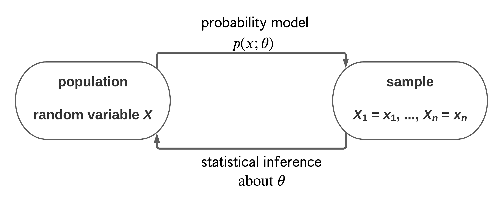
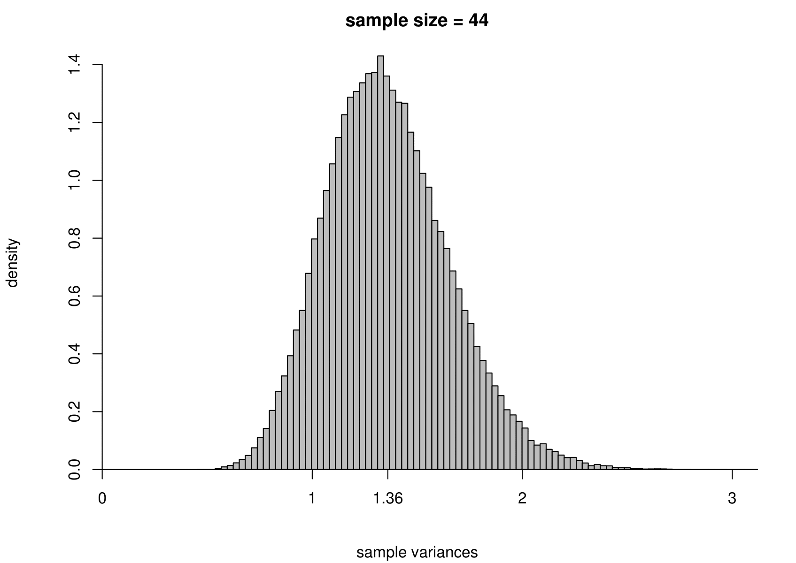
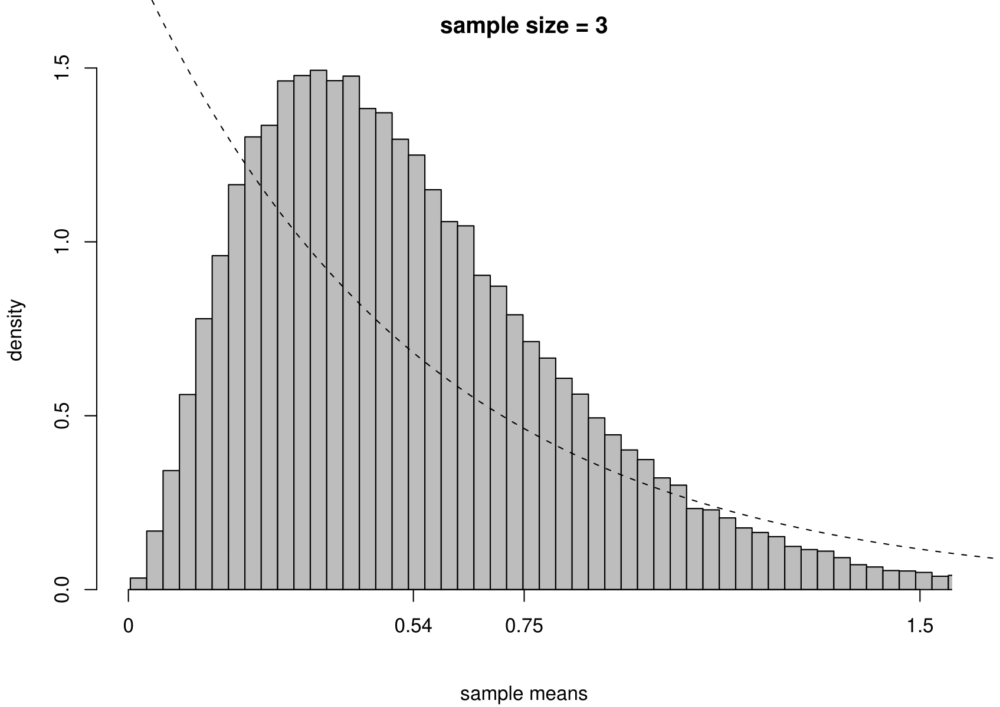
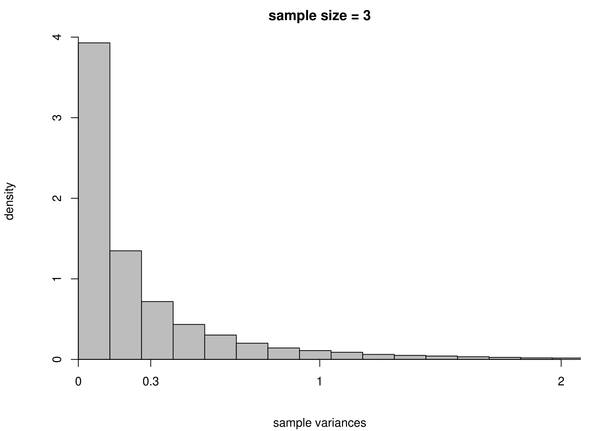
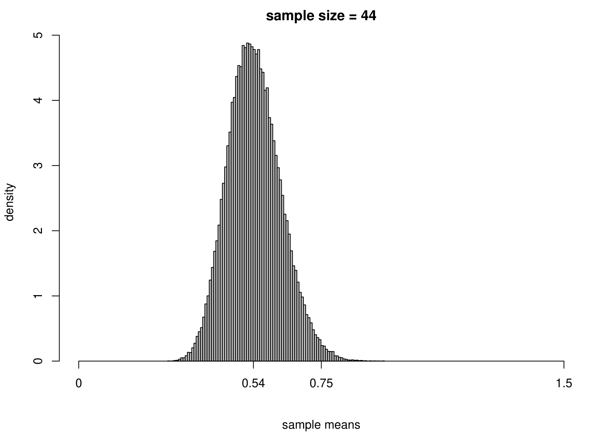
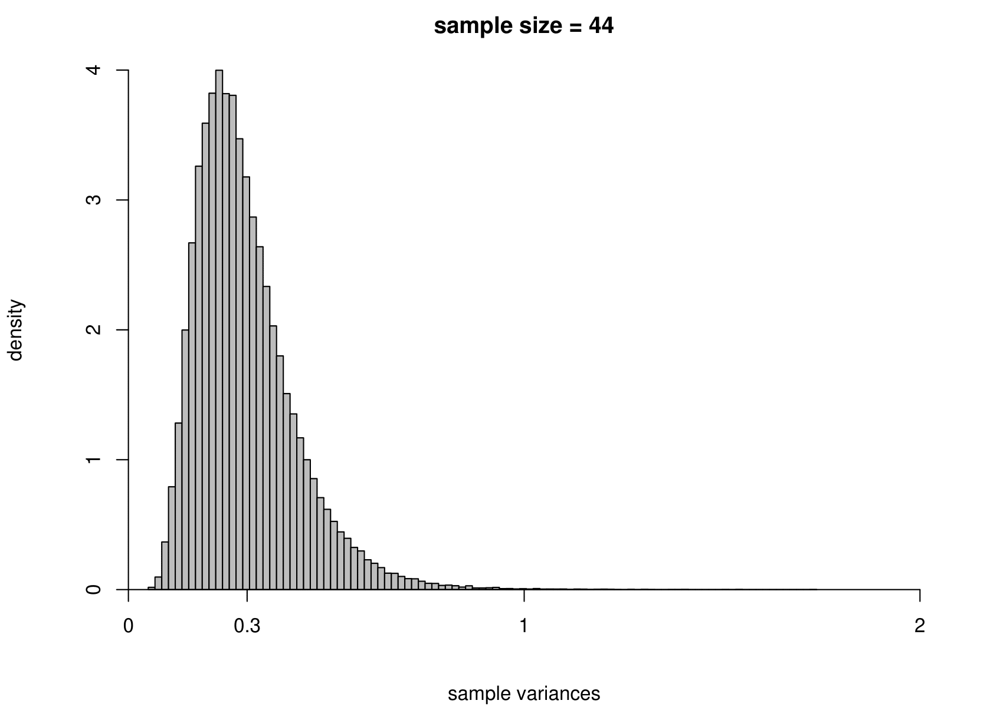
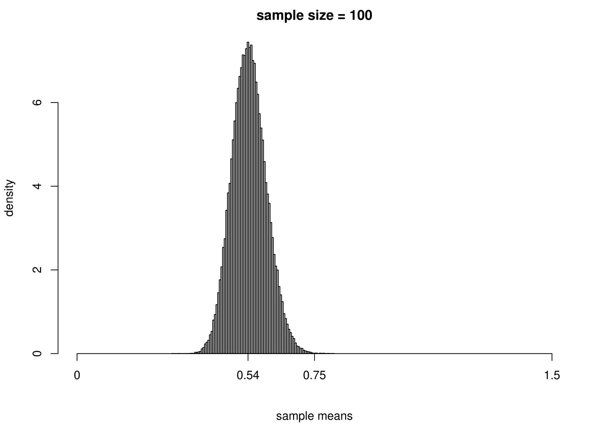
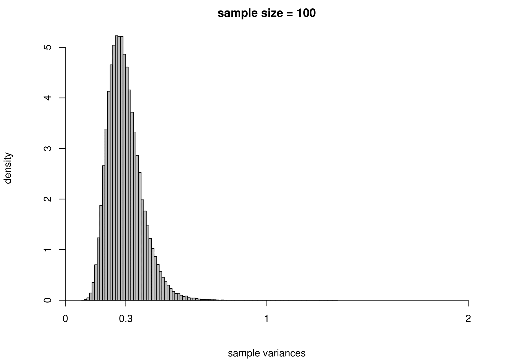

```{r, figsetup6, include=FALSE}
knitr::opts_chunk$set(
  fig.align = 'center',
  out.width = '75%'
)
```

# Statistical Inference {#inference}

Statistics is the science of collecting, analysing and interpreting data.
Statistical inference makes use of information from a sample to draw conclusions 
(inferences) about the population from which the sample was taken.

## The story so far

In Chapter \@ref(descriptive) we considered ways to describe and summarise **sample data**.  In Chapter \@ref(probability) we introduced the concept of the **probability** of an event and in Chapter \@ref(rvs) we defined a **random variable** to be a mapping of each value in the sample space to a real number.   In Chapter \@ref(simple) we considered some examples of some simple **probability distributions** for random variables that may describe the behaviour of a random quantity under certain special situations.  When we use a probability distribution in this way we may refer to it as a **probability model**.  In this chapter we consider how to use a probability model to make inferences about quantities of interest using sample data.

## Sample and populations

Suppose that we are interested in the distribution of some aspect of a population, for example, the outcomes of successive tosses of a coin. In many cases it is not possible to collect information on the entire population. Therefore, a subset of the population, a **sample**, is selected. The aim is to generalise from the particular sample collected to the population from which it came.  The sample should be representative of the population. This is often achieved most straightforwardly by random sampling, where each member of the population has an equal chance of being chosen and different selections from the population are independent.

## Probability models {#probmodels}

Often we makes inferences about a population using probability models. We view the data $X_1, X_2,...,X_n$ as random variables sampled randomly from a probability distribution.  The probability distribution often involves unknown constants, or **parameters**.  We use the data to estimate the values of these parameters. We should also quantify how uncertain we are about the values of the parameters. Generally speaking, the more data we have the more certain we can be about the approximate value of the parameters.  This process of is called **statistical inference**, because we are trying to infer the unknown population distribution and its parameters based on sample statistics.

Consider the coin-tossing example near the start of Chapter \@ref(probability).  The population of interest is the infinite set of outcomes which would be produced if Kerrich were able to toss the coin forever.  The sample is results of the 10,000 tosses which Kerrich actually carried out.  The population parameter of interest is the proportion $p$ of tosses on which a head is obtained.  If we assume that successive coin tosses are independent and that the probability $p$ of a head is the same on each toss, then the distribution of the total number $X$ of heads is binomial($10000, p$).  This binomial distribution is our probability model and $p$ is its unknown parameter.  Possible questions of interest are:
What is our 'best' estimate of $p$?  Can we provide an interval to quantify our uncertainty about $p$?  Is it plausible that $p=1/2$?

**Summary**

*  We are interested in the distribution of a random variable $X$.
*  Data: a random sample $X_1=x_1, \ldots, X_n=x_n$.
*  We assume that $X$ has a probability distribution with parameter $\theta$.  We might write $X \sim p(x; \theta)$.
*  We use data to make inferences about $\theta$ and therefore about the
distribution of $X$.

This is summarised in Figure \@ref(inference).

```{r echo=FALSE, inference, fig.show='hold', fig.cap='A schematic to describe the idea of statistical inference.', out.width = '80%'}

```

When using a probability model we should always bear in mind the following famous quote.

"... all models are wrong, some are useful." George Box.

By its nature a probability model is a simplification of reality.  The real data are not generated from our probability model.  However, if a probability model is a reasonable approximation to reality it can aid our understanding of the real world.  As the model is simpler than reality it should be easier to understand.  If the aim of modelling is to predict the future then we may not care whether the model is true or not as long as it predicts accurately enough for our purposes.

A less well-known, but no less true, quote is:

"All data are wrong." Richard Chandler.

We have seen (at least) one example of data which are wrong: we have good reason to believe that the vote for Buchanan in Palm Beach County is much larger than it should be. An important part of a statistical analysis is to check for errors or problems in the data. Some errors will be obvious (e.g. resulting from a decimal point being in the wrong place); others will be more difficult to spot. Simple graphical checks are often very effective for this purpose. Preliminary graphical descriptions of the can also indicate how best to analyse the data more formally.

## Fitting models

Usually a probability model involves unknown parameters, that is,  constants whose values we do not know. We use data to estimate the values of unknown parameters.  We have already seen several examples of this.

Often there is an obvious estimate.  For example, 

* in Section \@ref(binomial) we estimated the probability $p$ that a birth produces a baby boy by the sample proportion, 26/44, of babies who are boys.  
* in section \@ref(normal) we estimated the population  mean birth weight $\mu$ of babies by the sample mean birth weight $\bar{z}$ and the population standard deviation birth weight $\sigma$ by the sample standard deviation $s_z$.

In both these examples the parameter is clearly interpretable as a theoretical
property of a population: we estimate this property using the equivalent property of the observations.

There is a subtle, but important, difference between the words **estimator** and **estimate**.

*  An **estimator** is **rule** that, **before** we observe any data, we plan use to estimate a parameter.  For example, if we will observe $X_1, \ldots, X_n$ from a distribution with mean $\mu$ then an estimator of $\mu$ is 
\[ \hat{\mu}=\displaystyle\frac1n\sum_{i=1}^n X_i = \overline{X}. \] 
An estimator is a random variable: before we observe data we do not know which value the estimator will have.
*  An **estimate** is the value of an estimator **after** the data have been observed.  Once we have observed $X_1=x_1, X_2,=x_2, \ldots, X_n=x_n$ the estimate of $\mu$ is
\[ \hat{\mu} = \displaystyle\frac1n\sum_{i=1}^n x_i = \overline{x}. \]
An estimate is not a random variable, it is a constant.

Here, I have used the same notation, $\hat{\mu}$ for the estimator and the estimate.  However, the difference is clear from the fact that I have used capital $X$s to define the estimator and lower case $x$s to define the estimate.

**Point estimates and interval estimates**

A single value given as an estimate of a parameter is a **point estimate**.  It is good practice to give, in addition, an **interval estimate** or **confidence interval**.  The general idea of a confidence interval is described in Section \@ref(binominf).

There are many ways to create estimators of a parameter.  We will not study them here.  However, one general principle is often applied: we estimate the parameter by the value for which the data we observed are most likely.  This is the idea behind a method of estimation called maximum likelihood estimation.

## Uncertainty in estimation

We have already considered uncertainty in estimation in the space shuttle example. Here we recap the main ideas using the coin-tossing example.  In his coin-tossing experiment Jon Kerrich produced 5067 heads in 10,000 coin tosses. This produced an estimate $\hat{p}=0.5067$ of the probability of heads.  We are not certain that this is the true value of $p$: we are **uncertain** about the true value.

Suppose that Kerrich repeated his experiment a second time.  It is very unlikely that he would obtain exactly 5067 heads in the second experiment.  This makes it clear that the outcome of Kerrich's experiment is a random variable: before he tossed the coin no one knew what the outcome would be.  Therefore the estimator, $\hat{p}$, of $p$ resulting from the experiment is a random variable and has a distribution.  The distribution of an estimator is called its **sampling distribution** and its variability is called **sampling variability**.

### Simulation: coin-tossing example 

To study the sampling distribution of the estimator $\hat{p}$ we imagine Kerrich repeating his experiment a large number of times.  Each time the experiment is carried out the proportion of  heads is calculated.  These values are a random sample from the sampling distribution of  $\hat{p}$.  We cannot actually get Kerrich to repeat his experiment a large number of times. However, we can use a computer to simulate his experiment.  We do this 100,000 times,
assuming that the coin is fair, that is, $p=P(H)=1/2$.  Figure \@ref(fig:coinsim) shows a histogram of the 100,000 estimates of $p$. This histogram illustrates the sampling distribution of $\hat{p}$ if $p=1/2$.

```{r echo=FALSE, coinsim, fig.show='hold', fig.cap='Histogram of the proportions of heads obtained when Kerrich\'s coin tossing experiment is simulated 100,000 times, using $p=P(H)=1/2$.', out.width = '80%'}
knitr::include_graphics("images/coin_sim.png")
```

We can see that the estimates of $p$ vary approximately symmetrically about $p=1/2$. We also see that estimates that are larger than Kerrich's are only obtained quite rarely, in fact, only approximately 8.7\% of the time.  So, if $p=1/2$, Kerrich's estimate of $p$ was quite unusual, but is it so unusual that we might doubt that $p=1/2$?  This kind of question will be answered in STAT0003 using hypothesis testing.   

### Simulation: estimating the parameters of a normal distribution {#simnorm}

Suppose that we have a random sample of size $n$ from a normal distribution with unknown mean $\mu$ and variance $\sigma^2$.  That is,
\[ X_1, \ldots, X_n \,\stackrel{{\rm i.i.d.}}{\sim}\, N(\mu,\sigma^2). \]
We take the Australian birth weights data as an example, where we had $n=44$. For these data the sample mean is 7.22 pounds and the sample variance is 1.36 pounds$^2$.  We use $\mu = 7.22$ and $\sigma^2 = 1.36$ when we simulate data, but we would obtain the same general findings for other values of $\mu$ and $\sigma^2$. 

To study the sampling distribution of the estimators 
\[ \hat{\mu} = \frac1n \displaystyle\sum_{i=1}^n X_i = \overline{X} \qquad \mbox{and} \qquad 
\hat{\sigma}^2 = \frac{1}{n-1} \displaystyle\sum_{i=1}^n \left(X_i-\overline{X}\right)^2, \]
we simulate samples of size 44 from a $N(7.22,1.36)$ distribution.  We do this 100,000 times and plot a histogram of the estimates of $\mu$ and $\sigma^2$.

The results are in the third row of Figure \@ref(fig:normalsim). For comparison we also give the histograms for sample sizes of 3, 10 and 100. 

```{r echo=FALSE, normalsim, fig.show='hold', fig.cap='The sampling distribution of $\\hat{\\mu}$ and $\\hat{\\sigma}^2$ based on 100,000 independent simulations from a $N(7.22,1.36)$ distribution.  Left: mean.  Right: variance.  The dotted line in the top left plot is the p.d.f. of the $N(7.22,1.36)$ distribution. The sample size is given in the titles of the plots.', out.width = '45%'}
knitr::include_graphics("images/normal_sim_3_mean.png")
knitr::include_graphics("images/normal_sim_3_var.png")
knitr::include_graphics("images/normal_sim_10_mean.png")
knitr::include_graphics("images/normal_sim_10_var.png")
knitr::include_graphics("images/normal_sim_44_mean.png")

knitr::include_graphics("images/normal_sim_100_mean.png")
knitr::include_graphics("images/normal_sim_100_var.png")
```

We can see that

* as the sample size increases the variance of $\hat{\mu}$ and $\hat{\sigma}^2$ decreases: the estimators become more **precise**;
* the sampling distributions of $\hat{\mu}$ appear to be normal (in fact it can be shown that $\hat{\mu}$ is normally distributed with a mean of $\mu$ and a variance of $\sigma^2/n$) with means close to 7.22 pounds;
* the sampling distribution of $\hat{\sigma}^2$ is positively skewed for small sample sizes but becomes more symmetric as the sample sizes increases.

In practice we only have **one** dataset, providing **one** estimate. Recall (from the space shuttle example) that variability (variance) and uncertainty are closely related. Small variance results in small uncertainty: the estimate should not be far from the truth, whereas large variance results in large uncertainty: the estimate could be far from the truth.

### Simulation: estimating the parameters of an exponential distribution {#simexp}

Now we carry out exactly the same exercise for a random sample of size $n$ from an exponential distribution with unknown mean $\mu=1/\lambda$ and variance $\sigma^2=1/\lambda^2$.  That is,
\[ X_1,\ldots , X_n \,\stackrel{{\rm i.i.d.}}{\sim}\, \mbox{exponential}(\lambda). \]
We take times between births in the Australian births dataset as an example, where we had $n=44$.  We estimate $\mu$ using the sample mean, giving
\[ \hat{\mu} = 0.543 \mbox{ hours}, \quad \mbox{that is,  } \hat{\lambda}=1/0.543=1.84. \]
Although we know that for the exponential distribution the variance is the square of the mean, we estimate separately the variance of this distribution using the sample variance. The results are given in Figure \@ref(fig:expsim).

```{r echo=FALSE, expsim, fig.show='hold', fig.cap='The sampling distribution of $\\hat{\\mu}$ and $\\hat{\\sigma}^2$ based on 100,000 independent simulations from an exponential(1.84) distribution.  Left: mean.  Right: variance.  The dotted line in the top left plot is the p.d.f. of the exponential(1.84) distribution. The sample size is given in the titles of the plots.', out.width = '45%'}


knitr::include_graphics("images/exponential_sim_10_mean.png")
knitr::include_graphics("images/exponential_sim_10_var.png")




```

We see the same general behaviour as in the normal example (estimators become more precise as the sample size increases) but

**(i)** the sampling distribution of the sample mean is not exactly normal, but becomes closer to being normal as the sample size increases;

**(ii)** the sampling distribution of the sample variance is very positively skewed for small sample sizes but becomes more symmetric as the sample size increases.

### Central Limit Theorem (CLT)
 
Point (i) illustrates an important result called the (classical) **Central Limit Theorem**, whose consequence is that the sample mean of a **very large** random sample from a distribution with a finite mean and a finite positive variance is approximately normally distributed, regardless of the shape of the population distribution. In short, sample means (or indeed sample sums) may have approximately a normal distribution provided that the sample size is large enough. The sample size required depends on the shape of the population distribution: the closer the population distribution is to being normal the smaller is the sample size needed for the sample mean to be approximately normal.  (There are versions of the CLT in which some of the strong classical assumptions stated above can be replaced with weaker assumptions.)

## Properties of estimators {#good}

In Sections \@ref(simnorm) and \@ref(simexp) we saw that increasing the sample size $n$ reduced the variances of the estimators and made them more precise. In practice, we may not be able to increase the sample size because we are given a dataset of a certain size.  However, we can choose which estimator we use.  How can we choose a 'good' one, or even the 'best', according to some measure of quality?  A general idea is that a good estimator $T$ of a parameter $\theta$ has a sampling distribution that is as concentrated as closely as possible about $\theta$.  We consider some properties of an estimator using the following running example.

**Estimating mean of a normal distribution**

Suppose that 
$$X_1, \,\ldots,X_n \,\stackrel{{\rm i.i.d.}}{\sim}\, N(\mu,\sigma^2),$$ 
where $\sigma^2$ is positive and finite.  We define the estimator $\hat{\mu}=\overline{X}=\displaystyle\frac{1}{n}\sum_{i=1}^n\,X_i$ of $\mu$.

### Bias 

An estimator $T$ is **unbiased** for a parameter $\theta$ if $\mbox{E}(T)=\theta$ for all possible values of $\theta$.  The **bias** of $T$ is $\mbox{bias}(T)=\mbox{E}(T)-\theta$. If $T$ is unbiased then $\mbox{bias}(T)=0$.

We have seen that 
$$\hat{\mu} =\overline{X} \sim N\left(\mu,\frac{\sigma^2}{n}\right).$$
Therefore, $\mbox{E}(\overline{X}) = \mu$ and $\overline{X}$ is unbiased for $\mu$.

### Variance {#varianceofestimator}

Suppose that $T$ is unbiased for $\theta$.  If $\mbox{var}(T)$ is small then the sampling distribution of $T$ is concentrated closely about $\theta$.

Suppose that we compare 2 unbiased estimators $T_1$ and $T_2$.  If $\mbox{var}(T_1) < \mbox{var}(T_2)$ then we may prefer $T_1$ to $T_2$.  Both estimators have the property that the mean of sampling distribution is located at $\theta$ but $T_1$ varies less about this mean than $T_2$, as judged the sampling variance of the estimators.

Suppose now that we compare two estimators, $T_u$ and $T_b$, where $T_u$ is unbiased and $T_b$ is biased.  Based on this information alone, we might choose $T_u$.  However, if we find that $\mbox{var}(T_b) < \mbox{var}(T_u)$ then which estimator should we choose? One estimator wins on one property and the other estimator wins on the other property. One solution is to combine these two properties into one property. 

### Mean squared error (MSE)

The mean squared error $\mbox{MSE}(T)$) of an estimator $T$ is defined as
\[ \mbox{MSE}(T) = \mbox{E}[(T - \theta)^2]. \] 
We can show that
\begin{equation}
\mbox{MSE}(T) = \mbox{var}(T) + [\mbox{bias}(T)] ^ 2. 
(\#eq:mse)
\end{equation}
This is one way that we could combine bias and variance into one quantity.  If, for example, $\mbox{MSE}(T_b) < \mbox{MSE}(T_u)$ then, based on the $\mbox{MSE}$ criterion, we prefer $T_b$ to $T_u$.

### Standard error 

We have seen that the variance, or standard deviation, of an estimator is of interest.  Often, $\mbox{var}(T)$ depends on unknown parameters that need to be estimated from the data.  In cases like this we need to estimate the standard deviation of $T$ by substituting estimates for the unknown parameters in $\sqrt{\mbox{var}(T)}$.  This is then called the estimated **standard error** of $T$, or $\mbox{SE}(T)$.

For example, we found that $\mbox{var}(\hat{\mu})=\sigma^2/n$.  We estimate $\sigma$ using the sample standard deviation $\hat{\sigma} = \sqrt{\frac{1}{n-1}\sum_{i=1}^n (x_i-\overline{x})^2}$.  Therefore, $\mbox{SE}(\hat{\mu})=\hat{\sigma}/\sqrt{n}$.

### Consistency

**Definition**. An estimator $T$ is (weakly) consistent for $\theta$ if
\begin{equation}
P(| T-\theta |>\epsilon) \rightarrow 0 \quad \mbox{  as  } n \rightarrow \infty,
(\#eq:consistency)
\end{equation}
for any $\epsilon>0$ and for any possible value of $\theta$.  We refer to the property of weak consistency as simply **consistency**.

As the sample size $n$ increases to infinity we require that the probability that $T$ is arbitrarily close to $\theta$ increases to 1.  This is because $P(| T - \theta | \, \leq \epsilon) = 1 - P(| T - \theta | > \epsilon)$.  You may also see this idea expressed as "$T$ converges in probability to $\theta$" or $T \overset{p}{\to} \theta$, for short.

**Exercise**.  Use the condition in equation \@ref(eq:consistency) to show that, for our running example based on a random sample from a $N(\mu, \sigma^2)$ distribution, $\overline{X}$ is a consistent estimator of $\mu$.

The normality assumption is not necessary here, owing to the weak law of large numbers.

**The weak law of large numbers (WLLN)**.  If $X_1, ..., X_n$ are i.i.d. with $\mbox{E}(X_i)=\mu$, for $i=1, ..., n$ then $\overline{X} \overset{p}{\to} \mu,$ that is, $\overline{X}$ is a consistent estimator of $\mu$. (The strong assumptions in the classical statement of the WLLN can be replaced with weaker ones.)

For an estimator $T$ to be consistent it is **necessary** for the condition in equation \@ref(eq:consistency) to hold.  However, in many cases it is easier to prove that $T$ is consistent for $\theta$ in a different way.  If $\mbox{MSE}(T) \rightarrow 0$ as $n \rightarrow \infty$ then it can be shown that the condition in equation \@ref(eq:consistency) holds, which provides a **sufficient** condition for $T$ to be consistent for $\theta$.  If we can find $\mbox{MSE}(T)$ and show that it tends to zero as $n$ tends to infinity then we have shown that $T$ is consistent for $\theta$. Owing to equation \@ref(eq:mse), we could, equivalently, show that $\mbox{E}(T) \rightarrow \theta$ as $n \rightarrow \infty$ and $\mbox{var}(T) \rightarrow 0$ as $n \rightarrow \infty$.  If $\mbox{bias}(T) \rightarrow 0$ as $n \rightarrow \infty$ then we say that $T$ is asymptotically unbiased for $\theta$.

Note that if $\mbox{MSE}(T)$ does not tend to zero as $n$ tends to infinity then this does **not** mean that $T$ is not consistent for $\theta$.  It just means that we need to use the condition in equation \@ref(eq:consistency) to establish whether or not $T$ is consistent.  It is possible for $T$ to be consistent even thought $\mbox{MSE}(T)$ does not tend to zero as $n$ tends to infinity.

### Normal example

We return to our running example, which is based on a random sample

$$X_1, \,\ldots,X_n \,\stackrel{{\rm i.i.d.}}{\sim}\, N(\mu,\sigma^2),$$ 
where $\sigma^2$ is positive and finite.  We defined the estimator $\hat{\mu}=\overline{X}=\displaystyle\frac{1}{n}\sum_{i=1}^n\,X_i$ of $\mu$.

**Estimating mean of a normal distribution**

We have seen that $\mbox{E}(\overline{X})=\mu$, so that $\mbox{bias}(\overline{X})=0$ for all $n$.  Also, $\mbox{var}(\overline{X}) = \sigma^2 / n$, which tends to zero as $n$ tends to infinity.  Therefore, $\mbox{var}(\overline{X}) \rightarrow 0$ as $n \rightarrow \infty$ and $\overline{X}$ is a consistent estimator of $\mu$.  

How good is $\overline{X}$ as an estimator of $\mu$?  Is there an unbiased estimator of $\mu$ that has a smaller variance than the sample mean $\overline{X}$?  The answer is "No".  This is covered in the second year module STAT0005.

Which other estimator of $\mu$ could we use? The $N(\mu,\sigma^2)$ distribution is symmetric about $\mu$, so \[ \mbox{median}(X)=\mbox{E}(X)=\mu.\]
Therefore, we could use the sample median $\widetilde{\mu}$ to estimate $\mu$.

How much better an estimator of $\mu$ is the sample mean than the sample median?
It can be shown that $\widetilde{\mu}$ is unbiased and, for large $n$,
\[ \mbox{var}(\widetilde{\mu}) \approx 1.57\,\frac{\sigma^2}{n}, \]
compared to 
\[ \mbox{var}(\overline{X}) = \frac{\sigma^2}{n}. \]

This is illustrated in Figure \@ref(fig:meanmedian).  Note that this result relies on the assumption that the random sample is from a normal distribution.  If the data are sampled from another distribution then the sample mean may not have a smaller variance that the sample median.

```{r echo=FALSE, meanmedian, fig.show='hold', fig.cap='The sampling distribution of the sample mean and the approximate large sample sampling distribution of the sample median for a random sample from a $N(7.22, 1.36)$.  A sample size of 44 is used for illustration.', out.width = '75%'}
knitr::include_graphics("images/normal_mean_median.png")
```

**Estimating variance of a normal distribution**

Consider the following two estimators of $\sigma^2$.

\[ 
S^2 = \frac{1}{n-1} \displaystyle\sum_{i=1}^n \left(X_i-\overline{X}\right)^2 
\quad \mbox{and} \quad
S_n^2 = \frac{1}{n} \displaystyle\sum_{i=1}^n \left(X_i-\overline{X}\right)^2. 
\]

It can be shown that
\[ \mbox{E}(S^2) = \sigma^2 \qquad \mbox{and} \qquad \mbox{var}(S^2)=\frac{2}{n-1}\,\sigma^4. \]

Noting that $S_n^2 = \displaystyle\frac{n-1}{n}\,S^2$ we can infer that

\[ \mbox{E}(S_n^2) = \frac{n-1}{n}\,\sigma^2 \,\,< \sigma^2 \qquad \mbox{and} \qquad 
\mbox{var}(S_n^2)=\left( \frac{n-1}{n} \right)^2 \frac{2}{n-1}\,\sigma^4 \,\,< \mbox{var}(S^2). \]

Therefore, $S^2$ is unbiased for $\sigma^2$, whereas $S_n^2$ is biased, but $\mbox{var}(S_n^2) < \mbox{var}(S^2)$.

**Exercise**. Which of $S^2$ and $S_n^2$ has the smaller MSE?  

How crucial is the assumption of normality in our current example?

We remove the assumption of normality, so that we have $X_1, \ldots, X_n$ are i.i.d. and sampled from an (unspecified) distribution with an unknown mean $\mu$ and unknown variance $\sigma^2$.

Under these weaker assumptions it is still true that $\mbox{E}(\overline{X})=\mu$, $\mbox{var}(\overline{X})=\sigma^2/n$ and $\mbox{E}(S^2)=\sigma^2$. However, the expression that we gave for $\mbox{var}(S^2)$ **does** rely on the assumption of normality.

## Assessing goodness-of-fit

Once we have fitted a model to data a natural question to ask is: "How well does the model fit these data?"

Statistical modelling is an iterative process.  We fit a model and examine how well this model fits the data.  In other words, we **check** the model. If there is some aspect of the model which doesn't fit the data well, then we may try to improve the model and fit it again.  Sometimes several iterations are required before we obtain a model with which we are happy.  There are two ways in which a model may fail to fit the data well.

**Isolated lack-of-fit**.  Individual data points fall outside the general pattern of the data. For example, in the 2000 US Presidential election example it was clear that Buchanan's vote in Palm Beach county did not fit in the with the pattern of the rest of the data.

**Systematic lack-of-fit**.  The **overall** behaviour of the data is different from that of the model.  For example, in section \@ref(normal) our probability model for birth weights was a normal distribution with unknown mean and variance.  However, the histogram and normal QQ plot of birth weights we plotted suggest that this model does not fit the data well.  The lack-of-fit is not due to any particular set of observations - it is because the distribution of the data is fairly obviously skewed.

### Residuals

Residuals are measures of how closely a model agrees with the observed data.
The simplest kind of residuals are the differences between observations the $y_1, \ldots, y_n$ and the fitted values $\hat{y}_1,\ldots,\hat{y}_n$ under a model, that is,
\[ r_i = y_i-\hat{y}_i, \qquad i=1,\ldots,n. \]
The residuals $r_1,\ldots, r_n$ give measures of how closely the model agrees with each of the observations. A small residual indicates that the observed data value is close the fitted value under the model. A large residual indicates that the observed data value is not close the fitted value under the model.

One very large residual might indicate an isolated departure from the model.  The Buchanan's vote in Palm Beach county has a very large residual under the model fitted by Smith (2002).  Looking at residuals can also reveal systematic departures from the model.  We will consider this in sections \@ref(contingency) and \@ref(linreg).

As a simple example we return Australian births data.  Recall that we fitted a Poisson($\lambda$) distribution to the numbers of babies born in each of the 24 hours of the day, leading to $\hat{\lambda} = 1.83$.  Table \@ref(tab:poissonfit) shows the residuals for this fit.

| number of births | 0 | 1 | 2 | 3 | 4 | $\geq 5$ | total |
|:------:|:------:|:-------:|:------:|:------:|:------:|:-------:|:------:|
| $y_i$  | 3 | 8 | 6 | 4 | 3 | 0 | 24 | 
| $\hat{y}_i$ | 3.8 | 7.0 | 6.4 | 3.9 | 1.8 | 0.9 | 24 | 
| $r_i$ | -0.8 | 1.0 | -0.4 | 0.1 | 1.2 | -0.9 | 0 | 

Table: (\#tab:poissonfit) Observed values and fitted values (estimated expected frequencies) and residuals for a Poisson distribution fitted to the counts of babies born in each of the 24 hours in the Australian births data.

There are no very large residuals and there is no obvious pattern in the signs of the residuals. Overall, the Poisson distribution seems to fit well.  Of course, this is only an informal assessment.

### Standardised residuals

It is common to **standardise** residuals so that they each have approximately the same variance: usually a variance of 1.  Note: before we observe the data the residuals are random variables.  In some cases, for example for a linear regression model, standardised residuals should look like they have been sampled from a normal distribution, if the model is true.  If they do not, this suggests that the model is not true.

In this course we assess goodness-of-fit informally, using graphs and tables. We have already seen examples of this. For discrete data we compared observed proportions with theoretical probabilities and observed frequencies with estimated expected frequencies.  For continuous data we compared a histogram of the data with fitted p.d.f.s and looked at QQ plots.  Looking at graphs and tables can be useful, because if the fit is not good then they can help us to judge how we might need to improve the model.
